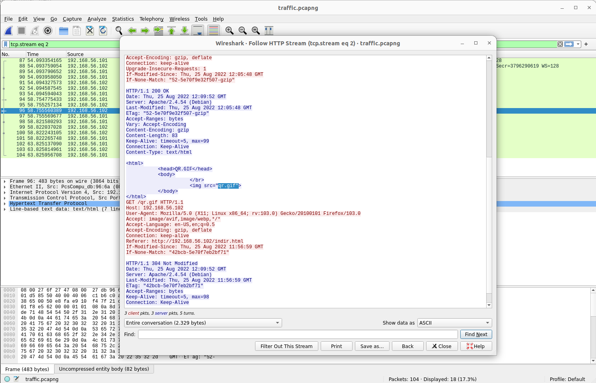
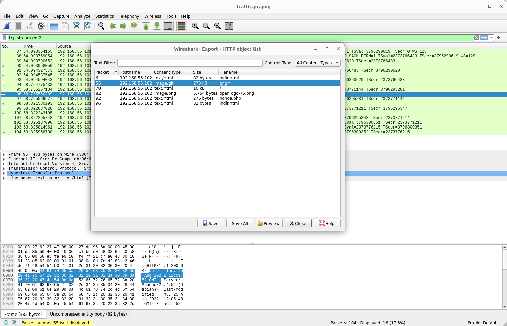
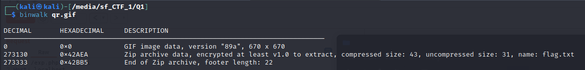
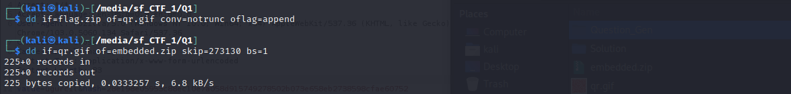

# STMCTF'22 Final

## Soru İsmi:

`Ayıkla beni`

### Kategori:
 - `Misc`

### Soru:
```
TR:
Elinde ki tek şey bir .pcap dosyası, yapman gerekense olabildiğince derinlemesine ilerlemek.

EN:
All you have is a .pcap file, and all you have to do is dig as deep as you can. 
```


## Çözüm:
```
İlk olarak pcap dosyasından pcap dosyasi üzerinden sağ tıkla » Follow » HTTP Stream adımları izlenerek HTTP trafiği çıkarılır. Bu trafikte bir qr.gif dosyası
olduğu anlaşılır.
```

```
File » Export objects » HTTP adımları üzerinden bu gif dosyası ayıklanarak diske kaydedilir.
```

```
Animated gif açıldığında birden fazla qrcode içerdiği görülür. GIF'in içeriği ayrılmadan önce binwalk ile dosya yapısı incelenir ve içerisine bir ZIP dosyası gömüldüğü belirlenir.
```
`binwalk qr.gif`


```
Gömülü ZIP dosyası dd veya binwalk komutuyla çıkartılır.
```
`dd if=qr.gif of=embedded.zip skip=<section_start> bs=1`

`binwalk -e qr.gif`


```
GIF dosyası frame'lerine ayrılır.
```
`sudo apt install graphicsmagick`

`gm convert -limit memory 300MB qr.gif -coalesce +adjoin frame%5d.png`
```
Her frame bir qrcode olduğu için içerikleri alınır.
Base64 ile encode edilen her qrcode çıktısı decode edilir. Ve çıktılardan bir tanesinin **password:Show me the money!** olduğu görülür.
```
`sudo apt install zbar-tools`

`zbarimg frame* | cut -d":" -f2 | base64 -d | grep --color --text password`
```
Elde edilen parola ile ZIP dosyası açılarak flag.txt extract edilir.
```
`sudo apt-get install stegsnow`

`stegsnow -C flag.txt`