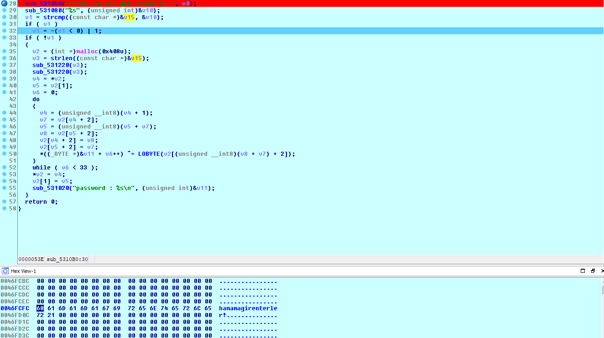
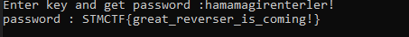

# STMCTF'22 Final

## Soru İsmi:

`baby crack`

### Kategori:
- `Reverse`

### Soru:
```
TR:


EN:

```

---

## Çözüm:
```
Kullanıcıdan alınan RC4 algoritmasına ait key değeri ile encryption text, decrypt edilmektedir. Key değerinin binary içerisinde yer aldığını strcmp() fonksiyonundan anlamaktayız. Key değerini elde etmek için v15 değişkeninin değerini dump etmemiz yeterli olacaktır.

Key değeri : hamamagirenterler!
```


```
Key değerini girerek flag elde edilmektedir.
```

