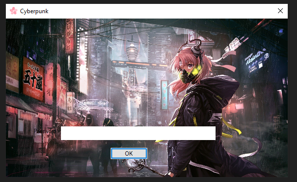
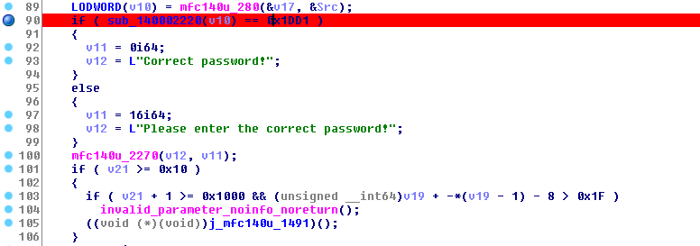
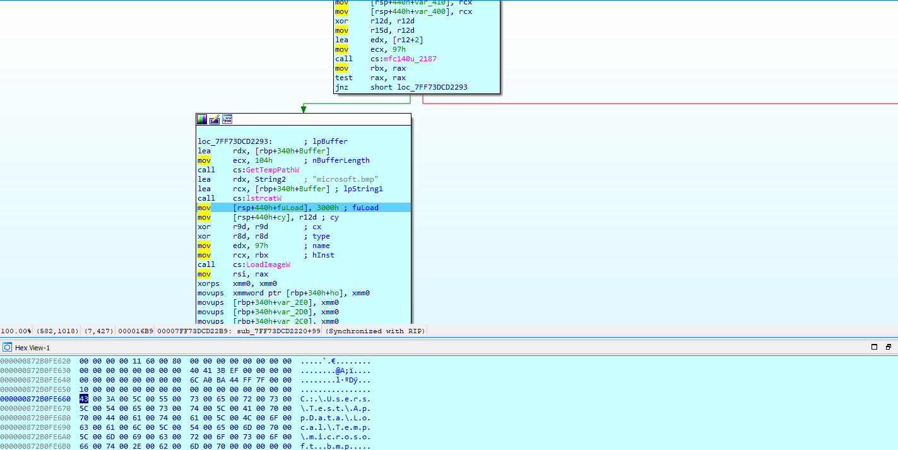
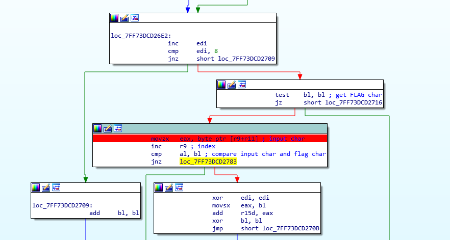
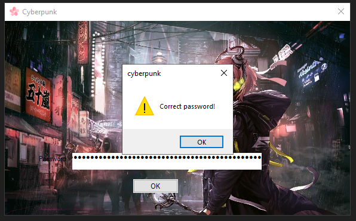

# STMCTF'22 Final

## Soru İsmi:

`cyberpunk`

### Kategori:
 - `Reverse`

### Soru:
```
TR:


EN:

```

---

## Çözüm:

Uygulamayı başlattığımızda, kullanıcının girdiği değer ile karşılaştırma yapan bir girdi alanının olduğunu görüyoruz.



Yanlış veri girdiğimizde doğru veriyi girmemizi isteyen bir pop-up çıkıyor. Karşılaştırma yapan kısmı bulmak için pop-up bulunduğu if/else bloğuna gidiyoruz ve doğru şifreyi elde edebilmek için sub_14000220() fonksiyonun geri dönüş değerinin 0x1DD1 olması gerektiğiniz anlıyoruz.



Bu fonksiyonu incelediğimizde ise memoryden okuduğu veriyi, %TEMP% dizinine "microsoft.bmp" olarak kaydettiğini görüyoruz. Aslında bu verinin arka plandaki resmin kendisi olduğunu anlıyoruz.



İç içe birden fazla for döngüsünün ve opencv fonksiyonlarının kullanıldığı görülmektedir. Bu sebeble encryption algoritmasının opencv kullanılarak yapıldığı düşünülmektedir. 

Karşılaştırma kısmına kadar gelindiğinde, kullanıcının girdiği karakter dizisinin ilk karakteri ile FLAG'in ilk karakteri karşılaştırılmaktadır. Buradan FLAG'in her karakteri için bu işlemin yapılması gerektiğini anlıyoruz.




FLAG'in doğru girilmesi halinde, FLAG'e ait karakterlerin ascii değerilerinin toplamı 0x1DD1 olacaktır. Böylece "Correct Password!" yazısını görüyor olacağız.

