# STMCTF'22 Final

## Soru İsmi:
`gizmo`


## Kategori:
- `Reverse`

## Soru:

```
TR:
Meydan okuyoruz, oynayarak çözemezsin. Eğlencesine oynayacaksan hızlı bir bilgisayar üzmez.

EN:
We dare you, U can't solve it by playing. If you're going to play for fun, a fast computer won't hurt.
```

---

## Çözüm:

.exe dosyasının içeriğine strings ile baktığımıza python ve pygame gibi bilgilere ulaşabiliyoruz.

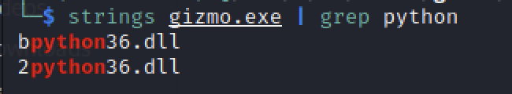

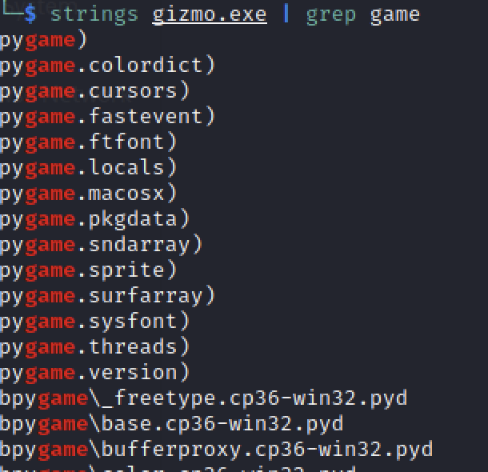

PyInstaller 4.10 ile python kodunun exe olarak paketlendiği anlaşılıyor.
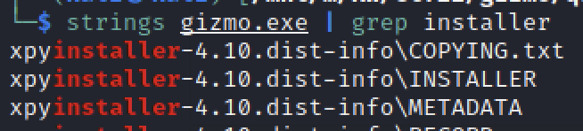

PyInstaller Extractor (https://github.com/extremecoders-re/pyinstxtractor) ile exe dosyasını içeriğini çıkartabiliyoruz. Python surumu ile ilgili sorun yaşanırsa ilgili sürümü kullanmak gerekebilir.
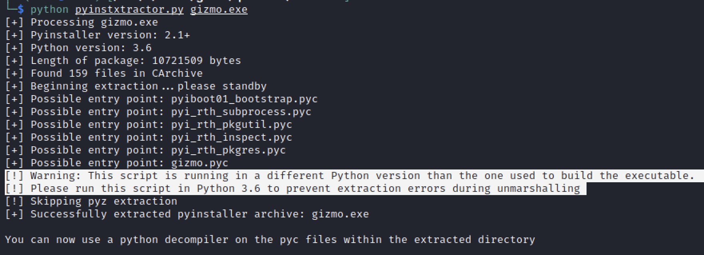

Python 3.6 surumu ile PyInstaller Extractor çalıştırıldığında dosya açma işlemi ikazsız tamamlanıyor.
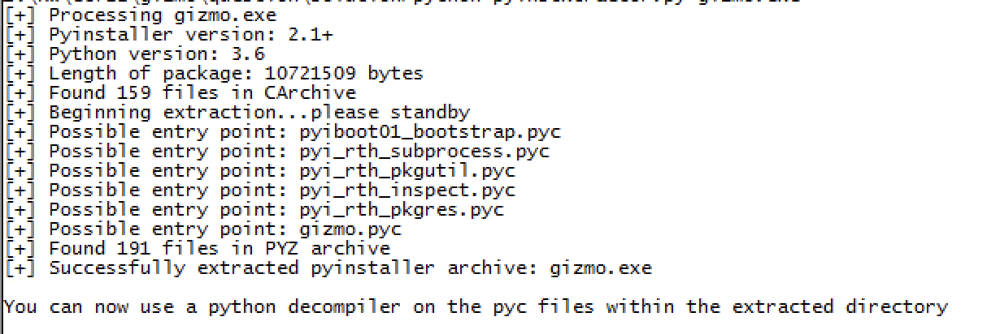

byte-compiled formatındaki gizmo.pyc dosyasına ulaşıyoruz. Bu dosyayı çalıştırabiliyoruz.

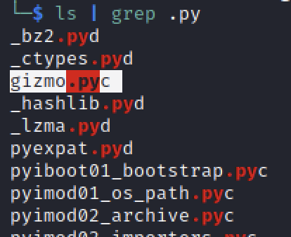

Dosyanın içeriğini .py olarak okuyabilmek için uncompyle6 (https://github.com/rocky/python-uncompyle6/) kullanılabilir. Bazı kurulumlarda komutun sonuç vermesi uzun sürebiliyor.

```uncompyle6 -o gizmo.py gizmo.pyc``` ile .py dosyasını elde edebiliyoruz. Dosyanın kendi içerisiden bulanıklaştırılımış olduğu gözüküyor.

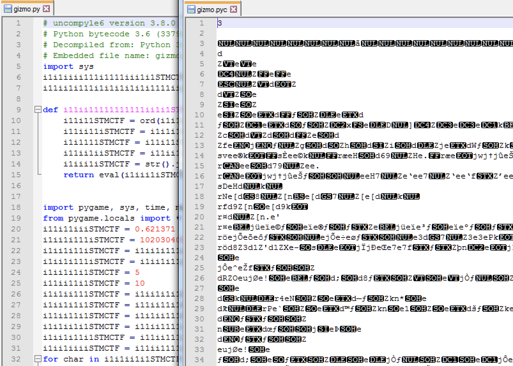

Bu aşamadan sonra soru farklı şekillerde çözülebilmektedir.

python gizmo.py ile oyunu çalıştırabiliyoruz. Eğer çalıştırılabilirse değişkenler ve if bloklarına brute force yapılarak biraz da şans faktörü ile flag ekrana bastırılabilir. 

Eğer gizmo.py çalıştırıldığında ekrana oyun gelmez ise ```python -m pdb gizmo.py``` ile debug edilebilir.

İstenirse FULLSCREEN özelliğini kod içerisinden kapatılabilir. Kod içerisindeki ,pygame.FULLSCREEN bilgisini silerek, debug ekranındayken tam ekrandan dolayı masaüstünün engellenmesi önlenir.

**Bu aşamada biz şu yöntemi kullandık.** Kod içerisinden kod parçalarından farklı bir .py dosyası oluşturularak çözme yöntemi ile çözüm şu şekilde yapılabilir:

Bütün string değişkenlerinin i11ii11111111111ii1i1STMCTF___ fonksiyonuna gönderildiği görülüyor. Stringlerin decode işleminin bu fonksiyon ile yapıldığını düşünebiliriz. Bu fonksiyonu ve fonksiyon içerisinde kullanılan iki farklı değişkeni yeni .py dosyasına alıyoruz.

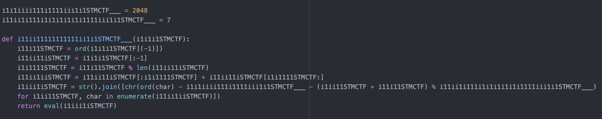

Bazı stringlerin içeriğini okuduğumuzda aşağıdaki sonuçları alıyoruz.
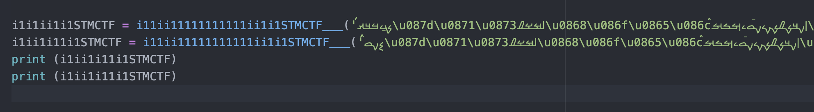

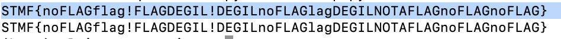

Diğer stringleri bu fonksiyona sokunca i1iii1i11iSTMCTF ve i11i1ii11STMCTF değişkenlerinde sadece sayıları kapsayan iki farklı string geliyor. Bu değerleri HEX to STRING gibi farklı yöntemlerle çözmeye çalışıyoruz ancak sonuç alamıyoruz.
Bu sayı stringlerinin kod içerisinde kullanım yerlerini bularak yeni kodun içerisine koyup sonuc almaya çalışıyoruz.


i1iii1i11iSTMCTF ve i11i1ii11STMCTF değişkenlerinin kodun başlarında kullanılan kod parçalarını çalışacak şekilde yeni .py dosyasına ekliyoruz.

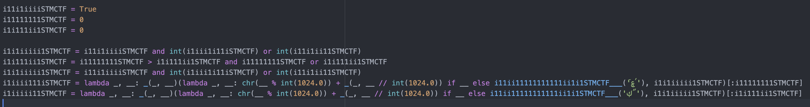

Kopyaladığımız kodların kullandığı değişkenleri kod içerisinde aradığımızda i11111111STMCTF += 1 ihtimali ile FLAG'i bir bir arttırma ihtimali olduğunu değerlendirebiliriz. Bu bilgiye ulaşamasak bile [:i11111111STMCTF] değeri bir stringin sadece belli bir uzunluğunun kullanılmasını sağladığı ipucunu yakalayabiliriz. (Veya bu tarz değişkenler bizi çözüme götürebilir.) Kodun sonuna print (i1iiii111iSTMCTF) ve print (i1iiiii11STMCTF) ekleyerek sonucu yazdırıyoruz. Değişkenlerin değerini yüksek bir sayı yaparak kodu tekrar çalıştırıyoruz. Türkçe Flag karşımıza çıkıyor.

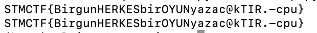


gizmo.py dosyasından çıkardığımız kodlardan oluşan writeup.py dosyası şu şekildedir.
```python
i1i1iiii111i1111iii1i1STMCTF___ = 2048
i11ii1i111i1i1i1i1i1i1111iii1i1STMCTF___ = 7

def i11ii11111111111ii1i1STMCTF___(i1i1i1STMCTF):
    i11i11STMCTF = ord(i1i1i1STMCTF[(-1)])
    i11ii11iSTMCTF = i1i1i1STMCTF[:-1]
    i1i1111STMCTF = i11i11STMCTF % len(i11ii11iSTMCTF)
    i11ii1iiSTMCTF = i11ii11iSTMCTF[:i1i1111STMCTF] + i11ii11iSTMCTF[i1i1111STMCTF:]
    i1iii1iSTMCTF = str().join([chr(ord(char) - i1i1iiii111i1111iii1i1STMCTF___ - (i1ii11STMCTF + i11i11STMCTF) % i11ii1i111i1i1i1i1i1i1111iii1i1STMCTF___) for i1ii11STMCTF, char in enumerate(i11ii1iiSTMCTF)])
    return eval(i1iii1iSTMCTF)


i1iii1i11iSTMCTF = i11ii11111111111ii1i1STMCTF___('ࠥ࠷࠸࠶࠸࠴࠲࠶࠽࠵࠹࠰࠹࠵࠷࠽࠶࠸࠵࠺࠶࠳࠵࠻࠾࠸࠳࠹࠼࠺࠽࠸࠲࠶࠷࠷࠴࠷࠼࠰࠱࠹࠴࠵࠸\u083f࠶࠴࠲࠹࠵࠼࠹࠴࠲࠶࠷࠺࠼࠺࠹࠲࠷࠴࠶࠸࠶࠹࠷࠷࠹࠹࠾࠽࠳࠸࠻࠺࠴࠸࠷࠰࠷࠷࠷࠵࠾\u083f࠸࠺࠺࠷࠻࠸࠽࠰࠳࠶࠳࠺࠵࠷࠰࠱࠸࠹࠷࠾࠼࠸࠲࠵࠻࠼࠷࠺࠹࠴࠲࠷࠹࠸\u083f࠵࠶࠵࠼ࠦ\u087d')
i11i1ii11STMCTF = i11ii11111111111ii1i1STMCTF___('ࠦ࠸࠹࠰࠹࠵࠳࠷࠾࠶࠳࠱࠺࠶࠸࠾࠷࠲࠶࠺࠵࠻࠼࠹࠸࠲࠹࠸࠽࠽\u083f࠸࠲࠻࠶࠽࠽࠾࠷࠴࠴࠶࠽࠾࠽࠱࠳࠴࠻࠵࠻࠻࠷࠴࠸࠼࠵࠷࠽࠹࠶࠹࠹࠼࠽࠸࠴࠺࠷࠷࠶࠼࠺࠷࠲࠶࠺࠻࠺࠹࠹࠸࠸࠻࠽࠻࠸࠵࠶࠸࠹࠷࠹࠷࠱࠳࠸࠼࠼࠻࠻࠵࠺࠴࠵࠽࠶࠹࠵࠴࠳࠹࠵࠸࠾࠵࠹࠴࠻࠹࠻࠻࠱࠺࠹࠹࠷ࠧ\u087e')

i11i1iiiiSTMCTF = True
i11111111STMCTF = 100
i1i111ii1STMCTF = 100

i1i1iiiii1STMCTF = i11i1iiiiSTMCTF and int(i1iii1i11iSTMCTF) or int(i11i1ii11STMCTF)
i1i111ii1STMCTF = i11111111STMCTF > i1i111ii1STMCTF and i11111111STMCTF or i1i111ii1STMCTF
i1i1iiiii1STMCTF = i11i1iiiiSTMCTF and int(i1iii1i11iSTMCTF) or int(i11i1ii11STMCTF)
i1iiii111iSTMCTF = (lambda _, __: _(_, __))(lambda _, __: chr(__ % int(1024.0)) + _(_, __ // int(1024.0)) if __ else i11ii11111111111ii1i1STMCTF___('ࠣࠤࢳ'), i1i1iiiii1STMCTF)[:i11111111STMCTF]
i1iiiii11STMCTF = (lambda _, __: _(_, __))(lambda _, __: chr(__ % int(1024.0)) + _(_, __ // int(1024.0)) if __ else i11ii11111111111ii1i1STMCTF___('ࠤࠥࢴ'), i1i1iiiii1STMCTF)[:i1i111ii1STMCTF]

print (i1iiii111iSTMCTF)
print (i1iiiii11STMCTF)
```
