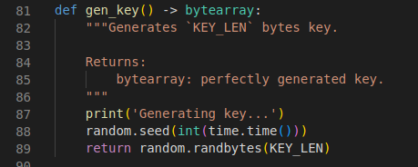
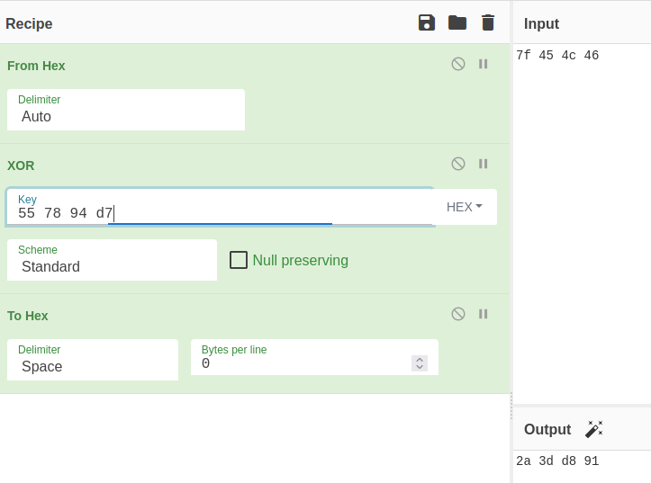

# STMCTF'22 Final

## Soru İsmi:
`last encryption bender`


## Kategori:
- `Crypto`

## Soru:

```
TR:
Hüsamettin, kendi yazdığı şifreleme betiği ile kendisi için çok önemli bir Linux çalıştırılabilir dosyasını şifrelemiş fakat şifreyi kaybetmiş. Sizden yardım bekliyor!

EN:
Hüsamettin encrypted a Linux executable file with his custom file encryptor script and he lost his key. He is asking for your help! 
```
---

## Çözüm:
```
Soruda verilen python kodu incelendiğinde dosya şifrelenirken üretilen parolanın, o günün zamanını (datetime) kullandığı görülür:
```

```
aynı seed atandıktan sonra aynı parolayı oluşturmak mümkün olduğundan parola tahmin edilmeye çalışılır.

Kod incelenmeye devam edildiğinde `_encrypt_data` fonksiyonunda dosyanın XOR ile şifrelendiği görülür.

Soru metninde şifrelenen dosyanın Linux çalıştırılabilir dosyası olduğu belirtildiği göz önünde bulundurulursa kullanılan parolanın bir kısmı ELF dosyasının imzasından bulunabilir.

ELF dosyaları `7f 45 4c 46` byte serisi ile başladığından şifrelenmiş dosyanın ilk 4 byte'ı ile tekrar XOR operasyonuna sokulduğunda parolanın ilk 4 byte'ı bulunmuş olur:




Python dosyasının başında kodun 5 Ocak 2022 olduğu verilmiştir. O halde şifrelenen dosya da bu tarihten sonra şifrelenmiştir.

Parolanın ilk 4 byte'ı `2a 3d d8 91` olduğu bulunduğuna göre aşağıdaki script ile brute force uygulanır:

    import random
    import time

    KEY_LEN = 256

    # 5 Ocak 2022
    START_EPOCH = 1641340800

    for i in range(START_EPOCH, int(time.time())):
        random.seed(i)
        key = random.randbytes(KEY_LEN)
        if key.startswith(b'\x2a\x3d\xd8\x91'):
            print(f'{key.hex()}')
            break


Script bittiğinde parolayı gösterir:

    2a3dd8918697dec04930bca8ff1016d0e3102eb19e1473c4054d476c320bde7275a82553c3e29cf2a3e2d366d46760a842ad4296ae2639f4c6b7328b1bafae402054c3467a2bb46631000567317c1c5fa62d290dae687be8637c944c87e1c5487ec58055bcd4eda8a96c19b05653041af323ca76ebc26bb134e00d2f938270720a12122d8c7cb2c3363d097b1b2d628c16379bdae1595bf767fad30f26b6d5328bfbf3bff56111c0c3cb1f08cbd6bbb507da059d266129d89eecc2981b80a941464f352ac80a716f7e81b95c5a82f06a34945cdc2bc0c93b660076391ee56b0390342ec43a1824a913cc33ebcfc0525639b83fd5d7912bc97135321b0df2a9c7


Bu parola ile dosya çözülür:

    $ python lock.py decrypt --file flag.encrypted --key 2a3dd8918697dec04930bca8ff1016d0e3102eb19e1473c4054d476c320bde7275a82553c3e29cf2a3e2d366d46760a842ad4296ae2639f4c6b7328b1bafae402054c3467a2bb46631000567317c1c5fa62d290dae687be8637c944c87e1c5487ec58055bcd4eda8a96c19b05653041af323ca76ebc26bb134e00d2f938270720a12122d8c7cb2c3363d097b1b2d628c16379bdae1595bf767fad30f26b6d5328bfbf3bff56111c0c3cb1f08cbd6bbb507da059d266129d89eecc2981b80a941464f352ac80a716f7e81b95c5a82f06a34945cdc2bc0c93b660076391ee56b0390342ec43a1824a913cc33ebcfc0525639b83fd5d7912bc97135321b0df2a9c7

ELF dosyası çalıştırılır ve flag programın çıktısıdır:

    $ chmod +x flag && ./flag 


```
