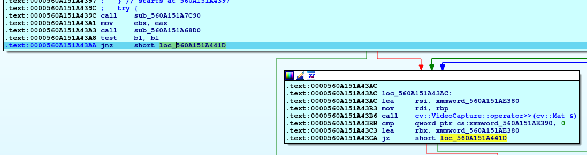
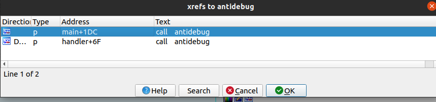
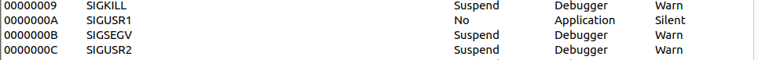
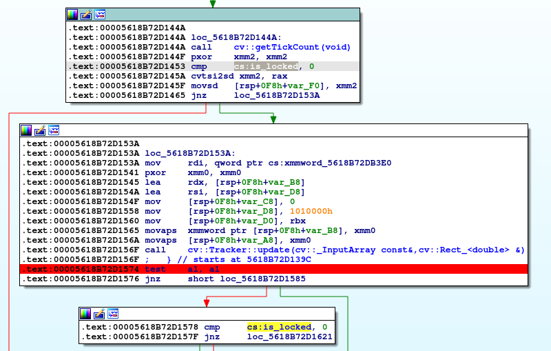
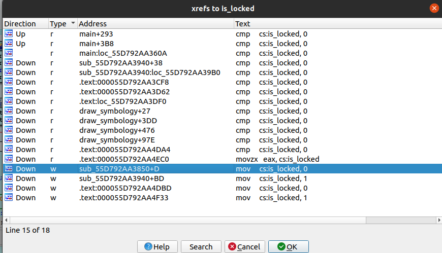
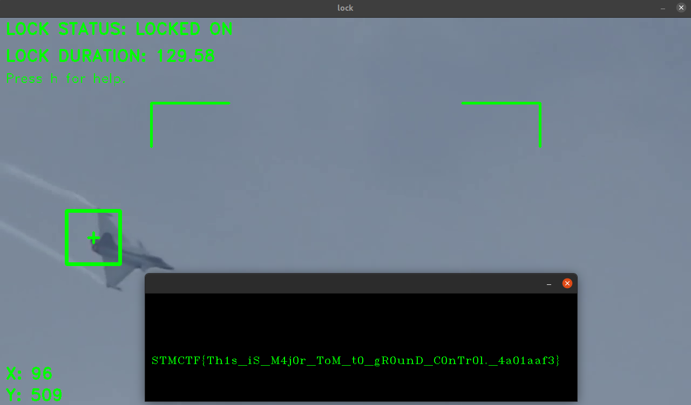

# STMCTF'22 Final

## Soru İsmi:
`lock`


## Kategori:
- `Reverse`


## Soru:
```
TR:
Kilidi uygun sürede tut, bayrağı kap!
EN:
Try to keep locked long enough if you want to capture the flag!
```
---

## Çözüm:

Sh dosyası çalıştırıldığında şöyle bir hata alınır:

`/tmp/./lock: error while loading shared libraries: libopencv_tracking.so.4.2: cannot open shared object file: No such file or directory`

Uygulamanın opencv'ye ihtiyaç duyduğu görülür, kurulu değilse opencv kurulur:

`sudo apt install libopencv-dev`

OpenCV 4.2 versiyonu istediğinden Ubuntu 20.04 kullanılabilir ya da opencv 4.2 versiyonu kaynak kodu indirilip derlenebilir.

Verilen bash script dosyası açıldığında scriptin 3.satırda bash'e kadar olan kısımda bir komutun rev ile tersten okunup çalıştırıldığı görülür. Bu kısım (bash'e kadar olan kısmı) boş bir shell'de çalıştırıldığında aşağıdaki çıktı alınır:

```
$ echo (tail -n+5 -bash | tar zx -C /tmp) && (chmod +x /tmp/lock && /tmp/./lock)echo ")kcol/./pmt/ && kcol/pmt/ x+ domhc( && )pmt/ C- xz rat | $(echo $0 | rev) 5+n- liat(" | rev
(tail -n+5 -bash | tar zx -C /tmp) && (chmod +x /tmp/lock && /tmp/./lock)
```

Not: tail komutuna gelen "-bash" ifadesi, orijinal kodda $0 ile script dosyasına işaret etmektedir.

Bu komutla script'in 5.satırından itibaren yer alan verinin tar ile /tmp dizinine açıldığı, ardından /tmp klasöründe yer alan lock dosyasının çalıştırıldığı görülür.

lock dosyası ida ile açılır ve incelenmeye başlanır.

Debuggerda çalıştırınca SIGABRT ile programın çıktığı görülür. Main fonksiyonun başından itibaren adım adım gidildiğinde aşağıdaki adımda antidebug yöntemi olduğu görülür.



Antidebug kontrolü yapılan fonksiyonunun kullanıldığı yerler atlanır:



Devam edildiğinde SIGUSR1 sinyalinin gönderildiği görülür. Debugger ayarlarından bu sinyal uygulamaya paslanır:



Şimdi dinamik analiz için herhangi bir engel kalmamıştır. Bu kısımdan sonra kilit kontrolünün yapıldığı yerleri bulmak gerekmektedir. OpenCV kullanıldığını biliniyordu. ELF dosyasının opencv import'larına bakılır:

```
$ objdump -T ~/ctf22-questions/lock/workspace/build/lock | c++filt | grep cv
0000000000000000      DF *UND*  0000000000000000              cv::imshow(std::__cxx11::basic_string<char, std::char_traits<char>, std::allocator<char> > const&, cv::_InputArray const&)
0000000000000000      DF *UND*  0000000000000000              cv::line(cv::_InputOutputArray const&, cv::Point_<int>, cv::Point_<int>, cv::Scalar_<double> const&, int, int, int)
0000000000000000      DF *UND*  0000000000000000              cv::VideoCapture::operator>>(cv::Mat&)
0000000000000000      DF *UND*  0000000000000000              cv::VideoCapture::isOpened() const
0000000000000000      DF *UND*  0000000000000000              cv::VideoCapture::get(int) const
0000000000000000      DF *UND*  0000000000000000              cv::fastFree(void*)
0000000000000000      DF *UND*  0000000000000000              cv::TrackerMOSSE::create()
0000000000000000      DF *UND*  0000000000000000              cv::VideoCapture::~VideoCapture()
0000000000000000      DF *UND*  0000000000000000              cv::rectangle(cv::_InputOutputArray const&, cv::Rect_<int>, cv::Scalar_<double> const&, int, int, int)
0000000000000000      DF *UND*  0000000000000000              cv::Tracker::init(cv::_InputArray const&, cv::Rect_<double> const&)
0000000000000000      DF *UND*  0000000000000000              cv::namedWindow(std::__cxx11::basic_string<char, std::char_traits<char>, std::allocator<char> > const&, int)
0000000000000000      DF *UND*  0000000000000000              cv::Mat::zeros(int, int, int)
0000000000000000      DF *UND*  0000000000000000              cv::putText(cv::_InputOutputArray const&, std::__cxx11::basic_string<char, std::char_traits<char>, std::allocator<char> > const&, cv::Point_<int>, int, double, cv::Scalar_<double>, int, int, bool)
0000000000000000      DF *UND*  0000000000000000              cv::VideoCapture::VideoCapture(std::__cxx11::basic_string<char, std::char_traits<char>, std::allocator<char> > const&, int)
0000000000000000      DF *UND*  0000000000000000              cv::VideoCapture::release()
0000000000000000      DF *UND*  0000000000000000              cv::Tracker::update(cv::_InputArray const&, cv::Rect_<double>&)
0000000000000000      DF *UND*  0000000000000000              cv::getTickCount()
0000000000000000      DF *UND*  0000000000000000              cv::getTickFrequency()
0000000000000000      DF *UND*  0000000000000000              cv::Mat::deallocate()
0000000000000000      DF *UND*  0000000000000000              cv::waitKey(int)
0000000000000000      DF *UND*  0000000000000000              cv::setMouseCallback(std::__cxx11::basic_string<char, std::char_traits<char>, std::allocator<char> > const&, void (*)(int, int, int, int, void*), void*)
0000000000000000      DF *UND*  0000000000000000              cv::destroyAllWindows()
0000000000009700  w   DF .text  000000000000006f  Base        cv::Mat::~Mat()
0000000000009700  w   DF .text  000000000000006f  Base        cv::Mat::~Mat()

```
Burada cv::TrackerMOSSE::create() ve cv::Tracker::update() fonksiyonları önem arz etmektedir. TrackerMOSSE opencv'de bulunan object tracker algoritmalarından biridir. Bu programda bu algoritmanın kullanıldığı görülür. Ayrıca cv::Tracker::update() fonksiyonu ise tracker algoritmasına frame'lerin beslenip takibin hala devam edip etmediği yorumlanır.

IDA'ya geri dönüldüğünde update() fonksiyonunun kullanıldığı yer bulunur ve tracking sona erdiğinde ne yaptığı incelenir:



Update öncesi ve sonrası boolean bir değerin kontrol edildiği görülür. Kilit bilgisinin tutulduğu yer bulunduktan sonra bu değerin kullanıldığı fonksiyonlar incelenir:




Bu kontroller de atlatılıp uygulamada uçağa kilit atıldığında FOV'dan çıkması ve tracker algoritmasının takibi bırakması geçilmiş olur. 1 dk boyunca beklenir, flag alınır:




IDA üzerinde kullanılan atlatma scriptleri (breakpoint exports) aşağıdadır:
```idc
00005607290948B4
static main(void)
{
  auto bpt;

  bpt = Breakpoint();
  bpt.set_abs_bpt(0x5607290943aa);
  bpt.type=4;
  bpt.flags=9;
  bpt.pass_count=0;
  bpt.condition="ZF=1, 0";
  bpt.elang="IDC";
  Breakpoints.Add(bpt);

  bpt = Breakpoint();
  bpt.set_abs_bpt(0x560729094574);
  bpt.type=4;
  bpt.flags=8;
  bpt.pass_count=0;
  bpt.condition="AL=1, 0";
  bpt.elang="IDC";
  Breakpoints.Add(bpt);

  // buradaki RIP set edilen yer, uygulamanin bellekteki adresine gore degismektedir.
  // fonksiyonun cikisindaki ilk pop instruction'ina adresleyecek sekilde guncellenmelidir.
  bpt = Breakpoint();
  bpt.set_abs_bpt(0x560729094852);
  bpt.type=4;
  bpt.flags=8;
  bpt.pass_count=0;
  bpt.condition="RIP=0x00005607290948B4, 0";
  bpt.elang="IDC";
  Breakpoints.Add(bpt);

  bpt = Breakpoint();
  bpt.set_abs_bpt(0x560729095db2);
  Breakpoints.Add(bpt);

  bpt = Breakpoint();
  bpt.set_abs_bpt(0x560729098be6);
  bpt.type=4;
  bpt.flags=8;
  bpt.pass_count=0;
  bpt.condition="ZF=1, 0";
  bpt.elang="IDC";
  Breakpoints.Add(bpt);
}
```
