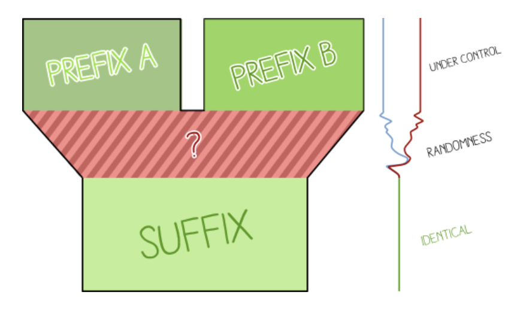
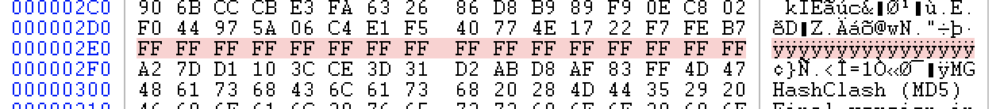
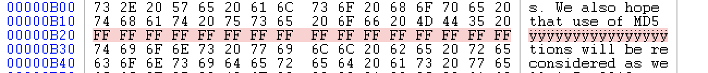
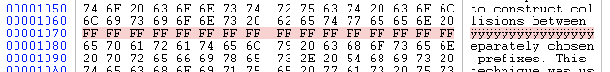
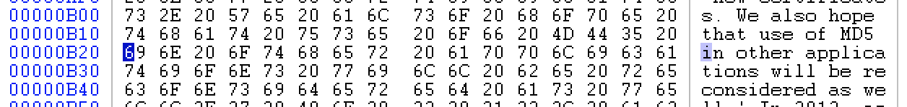
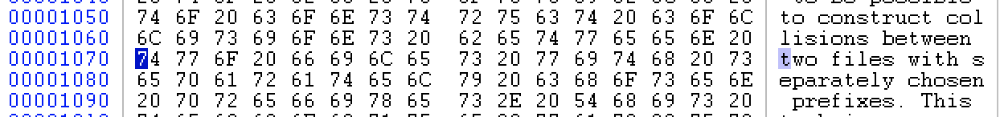
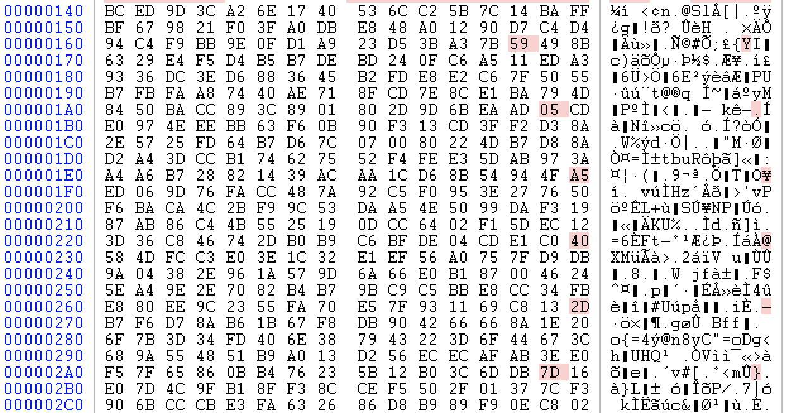
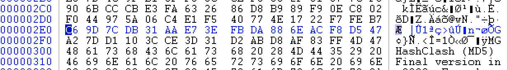

# STMCTF'22 Final

## Soru İsmi:
`oldschool 3/3`


## Kategori:
- `Crypto`


## Soru:

```
TR:
give_me ve theflag dosyalarını MD5 hash değerleri aynı ve SHA256 hash değerleri farklıydı. Maalesef theflag dosyasının içeriği bozuldu. Bozukluklar 16 bytle'lık 0xFF içerikli bloklar halinde gerçekleşti. 3 adet blok halinde toplam 48 byte'ın düzeltilmesi gerekiyor.
Dosyaların boyutlarını değiştirmeden her iki dosyanın MD5 hash değerlerini aynı ve SHA256 hash değerlerini farklı yapacak şekilde sadece theflag dosyasında düzeltmeleri yapıp dosyayı md5fix.stmctf.com adresine yüklediğinde flag sende.

Not: WEB/PWN sorusu değildir, md5fix.stmctf.com adresine saldırı yapmayın.

EN:
The give_me and theflag files had the same MD5 hash values and different SHA256 hash values. Unfortunately, a total of XX bytes were corrupted in theflag file content.
Make the MD5 hash values of both files the same and the SHA256 hash values different without changing the size of the files.
You only get the flag when you fix the theflag file and upload it to md5fix.stmctf.com page.

Note: It's not a WEB/PWN question, don't attack md5fix.stmctf.com.
```


---

## Çözüm:
Her iki dosyanın içeriğinde aşağıdaki text bilgiler gözüküyor.

  Framework for MD5 & SHA-1 Differential Path Construction and
  Chosen-Prefix Collisions for MD5. It's goal is to further understanding and
  study of the weaknesses of MD5 and SHA-1.

  Chosen-prefix collisions allow to collide any content.

İki dosyanın Chosen-prefix collision yöntemi ile oluşturulduğu ipucusu verildiği düşünülebilir. Ayırca arama motorlaru aramasında https://marc-stevens.nl/p/hashclash/ sayfasındaki bu konu ile ilgili bilgi bulunabiliyor.

Chosen-prefix collisions'daki yapı https://github.com/corkami/collisions sayfasında detaylı anlatılıyor.





Kısa olan prefix uzun olan prefixe eşit olacak şekilde bir sonraki blok'a kadar doldurulur. **Bloklar 64 Byte uzunluğunda olmaktadır.**
Son bloğun son 12 byte'ı rastgele olarak oluşturulan **birthday search** bloğu olmaktadır.

Soruda verilen her iki dosyanın da farklı prefix (5 x 64 byte) ile oluşturulduğu, collision bloğu (7 x 64 byte) sonrasında da suffix (0x300'den itibaren) bloğu olduğu görülüyor. Prefix bloğunun son 12 byte'ı rastgele olarak oluşturulan birthday search bloğudur.

Öncelikle Chosen-prefix collision yönteminde suffix'ler aynı olmalıdır. 1 adet 16 byte'lik hatalı blok collision bölümündedir. 2 adet 16 byte'lik hatalı blok suffix bölümündedir. theflag dosyasındaki bu alanların içeriğini give_me dosyası ile aynı yapmamız gerekiyor.

**theflag dosyasındaki bozuk alanlar**

collision bloğunda (theflag dosyası)


suffix bloğunda 1 (theflag dosyası)


suffix bloğunda 2 (theflag dosyası)



 Chosen-prefix collision yönteminde suffix'ler aynı olmalıdır. Bu nedenle **theflag dosyasındaki suffix bloğundaki bozuk alanları give_me dosyası ile aynı yapıyoruz.**

suffix bloğunda 1 (theflag dosyası)


suffix bloğunda 2 (theflag dosyası)


theflag dosyasındaki collision bloğunun 0x2E0 adresinde bulunan hata 16 byte olarak gözüküyor. Collision bloklarında farklı olan byte'ların birbirine uzaklıkları 16 byte'dan daha fazla oluyor. 16 byte içerisinde sadece bir adet byte'da farklılık olabileceği değerlendirilebilir. Çözümü buna göre oluşturabiliriz.

Collision bloğunda bulunan diğer farklı byte'lar **kırmızı** renktedir.


Collision bloğundaki farklı byte bilgileri ile ilgili açıklamalar ve link bilgileri dosyaların suffix bölümünde bulunuyor. Buralardaki dosyalar incelendiğinde örnek collision bölümlerindeki farklı byte'ların birbirinden 16 byte'dan daha uzakta olduğu gözüküyor. Bu nedenle 0x2E0 adresinde baslayan 16 byte'lık hata aslında give_me dosyasındaki 0x2E0 adresindeki 16 byte'dan sadece 1 byte farklı olacaktır. Bu çıkarım ile dosyanın bu bölümüne bruteforce yaparak çözmeyi deniyoruz. Her değişiklik sonrasında her iki dosyanın MD5 değerlerini aynı olup olmadığını kontrol ederek çözebiliriz. 

theflag dosyasındaki bu bölümü give_me dosyası ile aynı yapıp byte byte bruteforce yapacağız.



```python
import hashlib

# FILES
give_me = "give_me.coll"
theflag = "theflag.coll_edited"

bf_start = 0x02E0
bf_stop = 0x02EF

# READ FILES
with open(give_me, mode='rb') as file:
    give_meContent = file.read()

with open(theflag, mode='rb') as file:
    theflagContent = file.read()

# CALCULATE HASH
md5_give_me = hashlib.md5(give_meContent).hexdigest()
md5_theflag = hashlib.md5(theflagContent).hexdigest()
sha256_give_me = hashlib.sha256(give_meContent).hexdigest()
sha256_theflag = hashlib.sha256(theflagContent).hexdigest()

print ()
print ("Mevcut HASH degerler:")
print ("---------------------")
print ("MD5 giveme:",md5_give_me)
print ("MD5 theflag:",md5_theflag)
print ("SHA256 give_me", sha256_give_me)
print ("SHA256 theflag ", sha256_theflag)

print ()
print ("BRUTEFORCE Basladi:")
print ("---------------------")
# START BRUTEFORCE
for i in range(bf_start,bf_stop+1):
    print ("Byte: ", hex(i))
    original_value = theflagContent[i]

    # 0x00 - 0xFF
    for value in range (0,0xFF+1):
        theflagContent = list(theflagContent)
        theflagContent[i] = value
        theflagContent = bytes(theflagContent)

        md5_theflag = hashlib.md5(theflagContent).hexdigest()

        # FIXED ?
        if md5_theflag ==  md5_give_me:
            print ()
            print ("SONUC:")
            print ("------")
            print ("theflag dosyasinda degisecek byte:", hex(i))
            print ("Byte'in yeni icerigi:", hex(value))
            print ("MD5 give_me ", md5_give_me)
            print ("MD5 theflag ", md5_theflag)

            sha256_theflag = hashlib.sha256(theflagContent).hexdigest()
            print ("SHA256 give_me", sha256_give_me)
            print ("SHA256 theflag ", sha256_theflag)
            exit()

        # TRY NEXT BYTE
        theflagContent = list(theflagContent)
        theflagContent[i] = original_value
        theflagContent = bytes(theflagContent)

# DAMN IT !
print ("nope :( ")
```

```
Mevcut HASH degerler:
---------------------
MD5 giveme: 137eef7b085f7db1a898aa19912a620e
MD5 theflag: 7542634baadf73b4b1753914569042ab
SHA256 give_me 620355ebeb45cbee95f57f18922b1f0df8940c416a45e8e82ac6267b158d8925
SHA256 theflag  1290e42810ac4ef8b67ebb53cbc0f9e315915f89bda25d94bcc38f6443486a1f

BRUTEFORCE Basladi:
---------------------
Byte:  0x2e0
Byte:  0x2e1
Byte:  0x2e2
Byte:  0x2e3
Byte:  0x2e4
Byte:  0x2e5
Byte:  0x2e6
Byte:  0x2e7
Byte:  0x2e8
Byte:  0x2e9
Byte:  0x2ea
Byte:  0x2eb
Byte:  0x2ec
Byte:  0x2ed

SONUC:
------
theflag dosyasinda degisecek byte: 0x2ed
Byte'in yeni icerigi: 0xfc
MD5 give_me  137eef7b085f7db1a898aa19912a620e
MD5 theflag  137eef7b085f7db1a898aa19912a620e
SHA256 give_me 620355ebeb45cbee95f57f18922b1f0df8940c416a45e8e82ac6267b158d8925
SHA256 theflag  47daaeb6565594974b0c7c4f1367ddec8e2358d8c7516722f7d578c7e2246913
```

Scriptin çalışması çok hızlı olmaktadır. Maksimum 4096 (16 x 256) farklı olasılık denenmektedir.

theflag dosyasının 0xFC byte değerini giveme dosyasından farklı olarak 0xFC yaptığımızda her iki dosyanın da MD5 değerleri aynı, SHA256 değerleri farklı olmaktadır.
