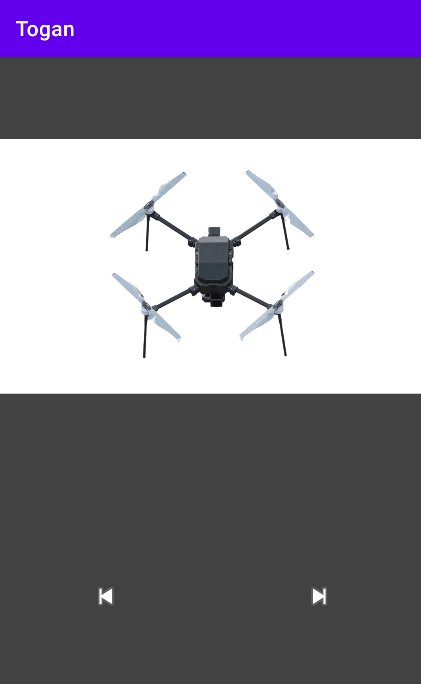
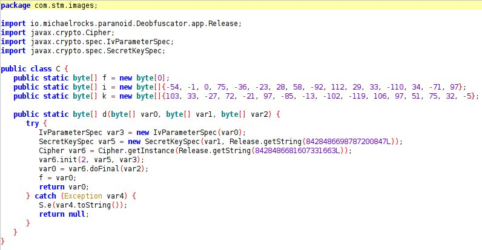
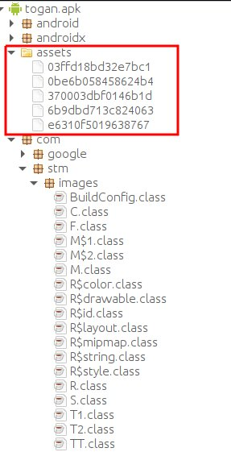
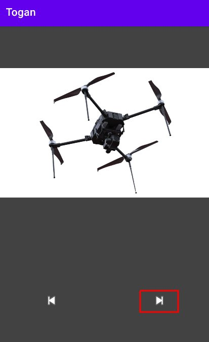

# STMCTF'22 Final

## Soru İsmi:
`togan`

## Kategori:
- `Mobil`

## Soru:
```
TR:
togan.apk

EN:
togan.apk
```


---

## Çözüm:

* Uygulama çalıştırıldığında aşağıdaki görselle karşılaşılıyor.



* Uygulama 'decompile' edilip kod incelendiğinde görselin 'asset' olarak bulunduğunu ve decrypt edildiği görülüyor.




* Uygulama 'decode' edildiğinde 'assets' dizininde beş adet dosya olduğu görülüyor.



* Uygulamadaki butona basılarak bütün görsellerin 'memory' de açık halde bulunması sağlanır.



* Aşağıdaki komutlar yardımıyla uygulamanın 'memory'si 'dump' edilerek emülatörden dışarı aktarılır.

```bash
adb shell am dumpheap <togan-pid> /data/local/tmp/android.hprof
```
```bash
adb pull /data/local/tmp/android.hprof
```

* Emülatörden dışarı aktarılan dosya 'strings' uygulaması ile aşağıdaki komutlar yardımıyla incelenir ve flag elde edilir.

Windows için:
```shell 
.\strings.exe -u .\android.hprof | findstr /i STMCTF
```

Linux için:
```bash
strings -e l android.hprof | grep STMCTF
```
