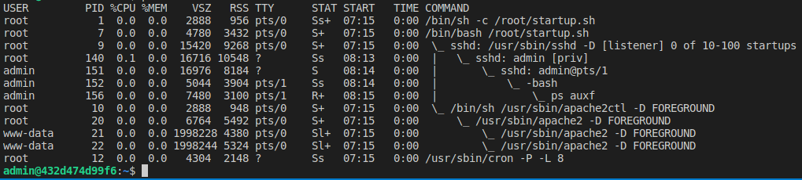
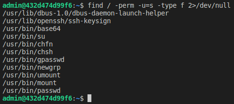
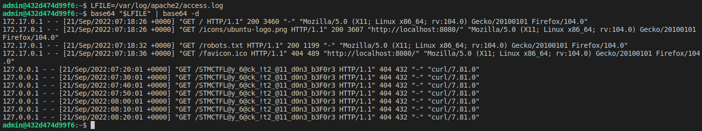

# STMCTF'22 Ön Eleme

## Soru İsmi:
`Avec-Caesar`


## Kategori:
- `Pwn`


## Soru:

```
TR:
Bora'nın bizler için hazırladığı bu küçük oyuna dikkat et. Sanırım bir yerlere birşeyler saklamış gibi, bulmakta bize yardım edebilir misin?

EN:
Pay attention to this little game that Bora has prepared for us. I guess it looks like he's hiding something somewhere, can you help us find it?
```

---

## Çözüm:
```
Makineye yapılan ssh isteğinde gelen ssh-banner incelendiğinde banner'ın Caesar Cipher ile şifrelendiği anlaşılır.
```

```
ssh-banner'a Caesar-Chiper -7 uygulandığında kısmen anlamlı bir hale gelmektedir. Fakat bazı kelimelerde eksik harflerin olduğu görülmektedir.
```

```
Bu eksik harfler çıkarıldığında kullanıcı adı ve parolası **admin:sgzweepc** olduğu anlaşılacaktır.

Makine bağlandıktan sonra **ps auxf** ile çalışan process'lere bakıldığında çalışan üç servis göze çarpar **cron, ssh ve apache**.
```

```
Sistem üzerinde priv escalation bulmak için taramalar yapıldığında "**find / -perm -u=s -type f 2>/dev/null**" çıktısında **base64** suid bitinin aktif edildiği anlaşılır.
```

```
**base64** ile apache logları incelendiğinde, flag bulunacaktır.
```
