# STMCTF'22 Ön Eleme

## Soru İsmi:
`Captain's Logs`


## Kategori:
- `Web`


## Soru:

```
TR:
Kaptan yanlislikla bayragi seyir defteri icinde kaybetmis. Onu bulmasina yardimci olabilir misin?

EN:
Captain has lost his flag in his logs. Can you help him find it?
```

---

## Çözüm:

Soruya baglanildiginda asagidaki ekran ile karsilasilir:

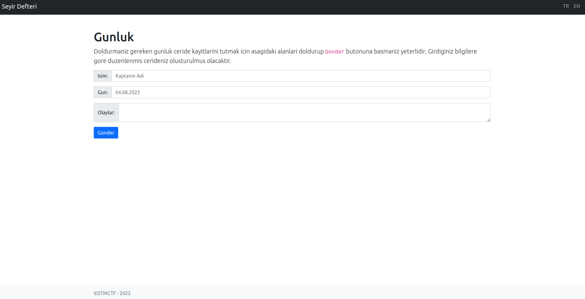

Ekranda yer alan alanlar tek tek Server Side Template Injection icin denenir ve **Isim** alaninin bu zafiyeti icerdigi gorulur:

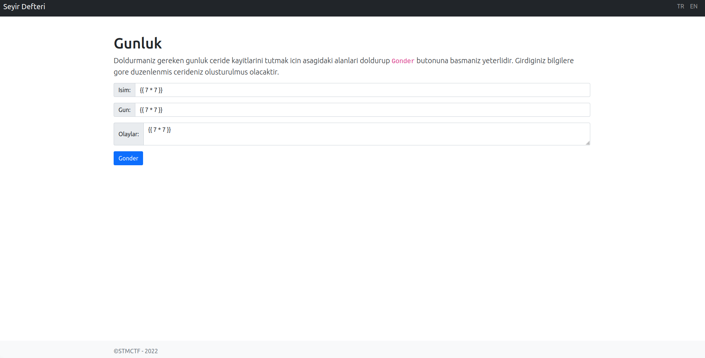
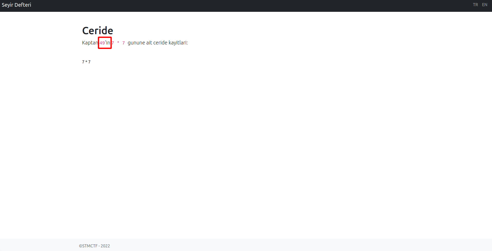

Sunucu uzerinde kod calistirilip calistirilamayacagi kontrol edilir. Bunun icin flask uygulamasinin **config.items()** listesinden yararlanilir. 

Oncelikle mevcut olan **config.items()** listesi kontrol edilir:

")
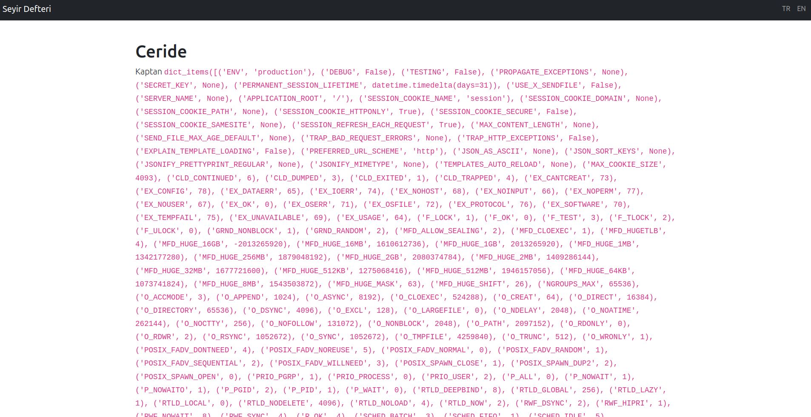

Diger kutuphanelerde mevcut olan fonksiyonlarin cagirilabilmesi icin once yuklenmeleri gerekir. Dosya sistemi ile iletisime gecmek icin **Subprocess.Open** fonksiyonu kullanilabilir. Bu fonksiyonu cagirabilmek icin once **os** kutuphanesinin yuklenmesi gerekir.

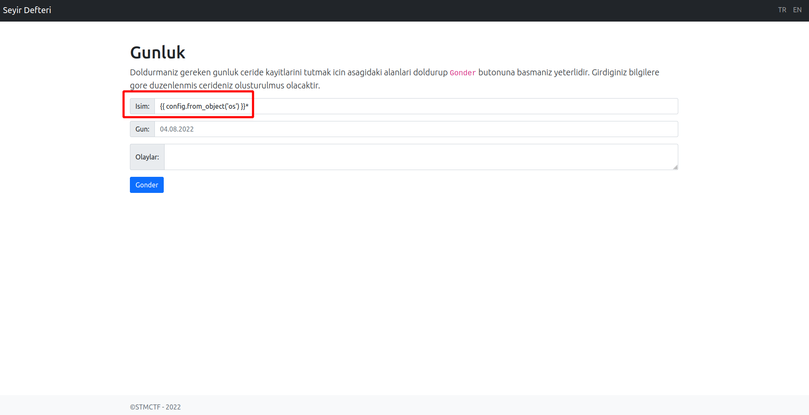
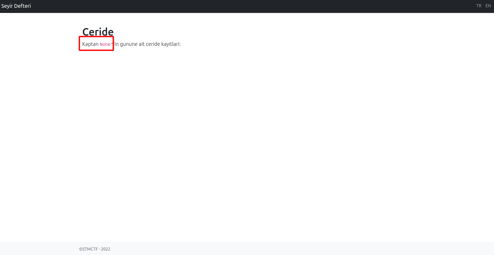

Yeni yuklenen kutuphaneleri listenir ve Popen fonksiyonunun cagirilmasi icin liste icindeki indeksi deneme yoluyla bulunur.

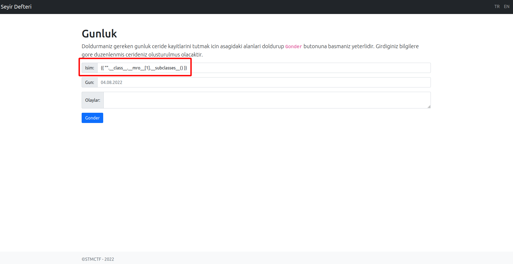
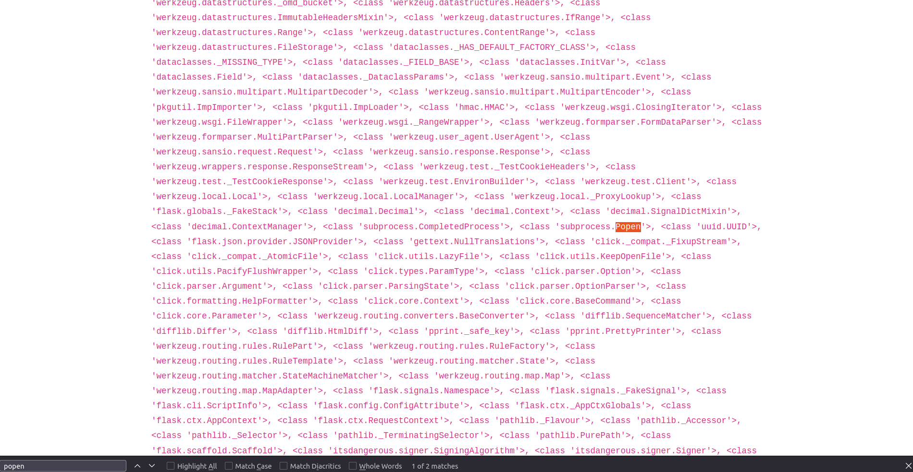
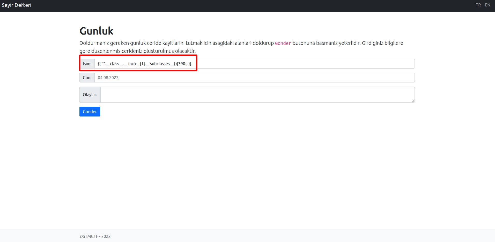
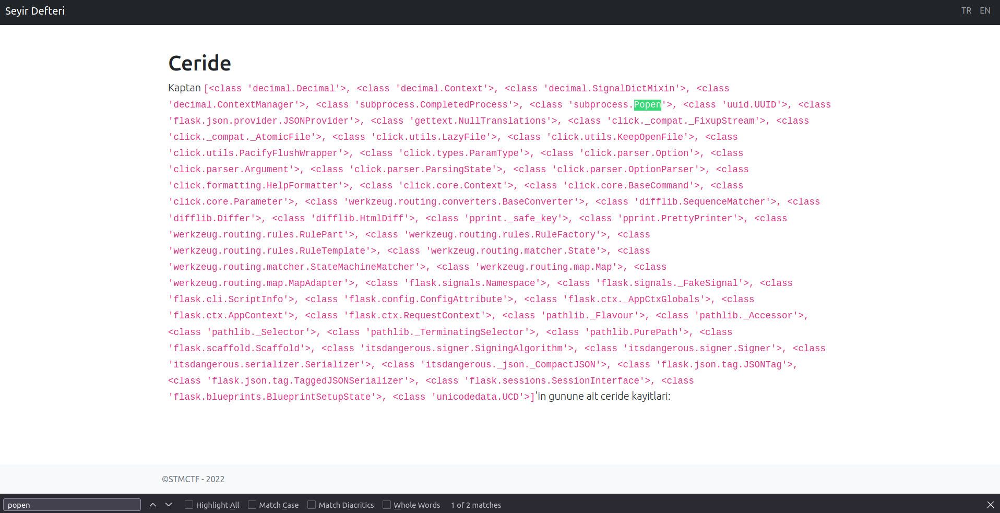

Fonksiyonun indeksinin **395** oldugu bulunur. Asagidaki yontem ile dosyalar listenir.

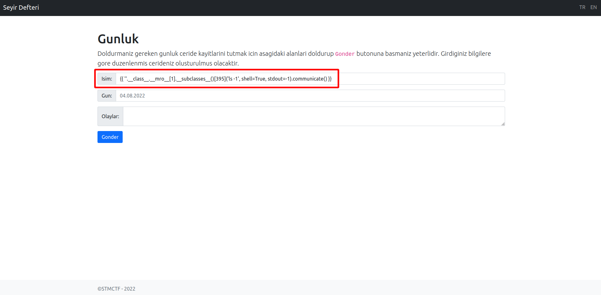
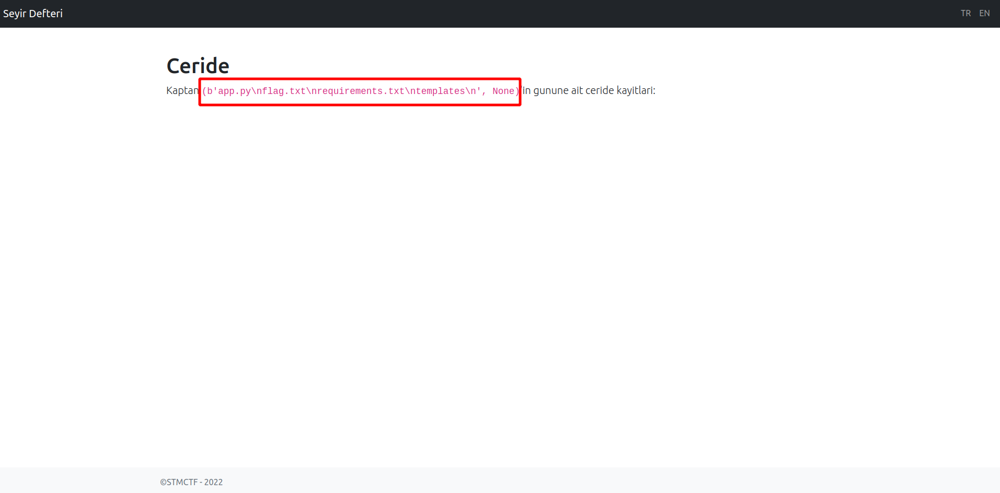

Listenen dosyalar arasinda flag.txt gorulur. **cat flag.txt** komutu ile dosya icerigi listenelir.

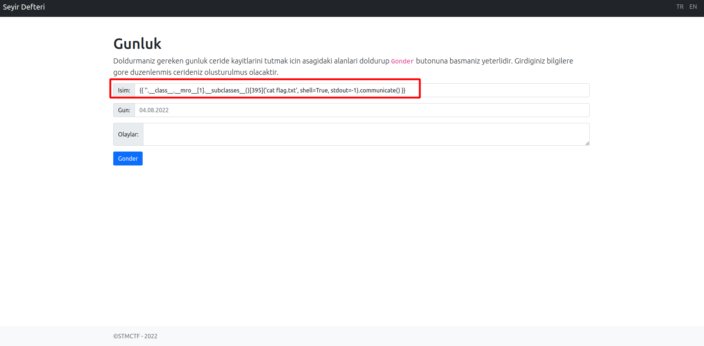
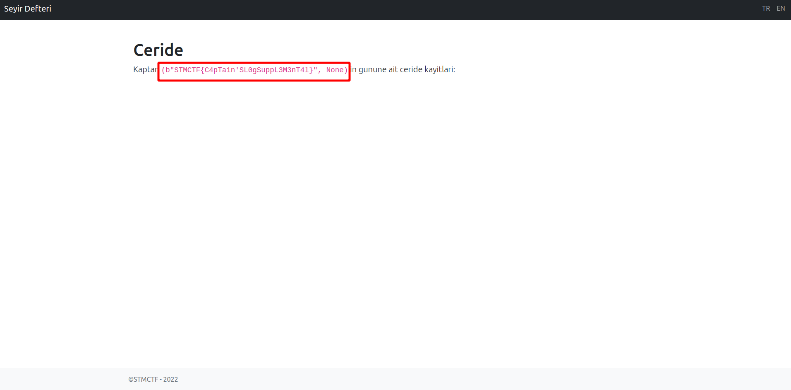
