# STMCTF'22 Ön Eleme

## Soru İsmi:
`Neo, you are the one!`


## Kategori:
- `Web`


## Soru:

```
TR:
Sistem yöneticimizin (Admin) web panel aracılığı ile yönettiği sunucumuza erişemiyoruz. Panele girin ve bize yardım edin lütfen!

EN:
We cannot access our server, which is managed by our system Admin via the web panel. Login to the panel and help us please!
```

---

## Çözüm:
```
TR:

Verilen URL'ye gittiğimizde karşımıza bir giriş ekranı geliyor.
```
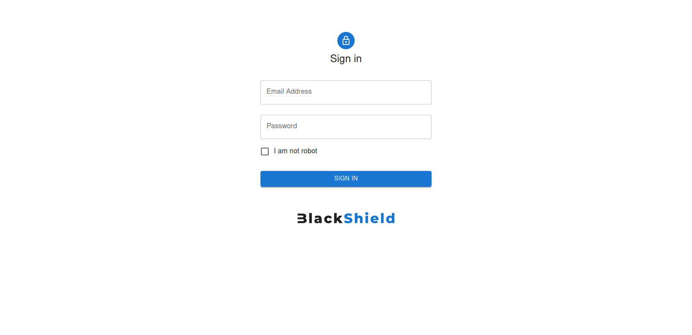
```
"admin@blackshield.com:admin" gibi default credentials ile giriş yapamadığımız için uygulama içerisinde herhangi bir yerde credential unutulmuş mu diye kontrol ediyoruz.
```
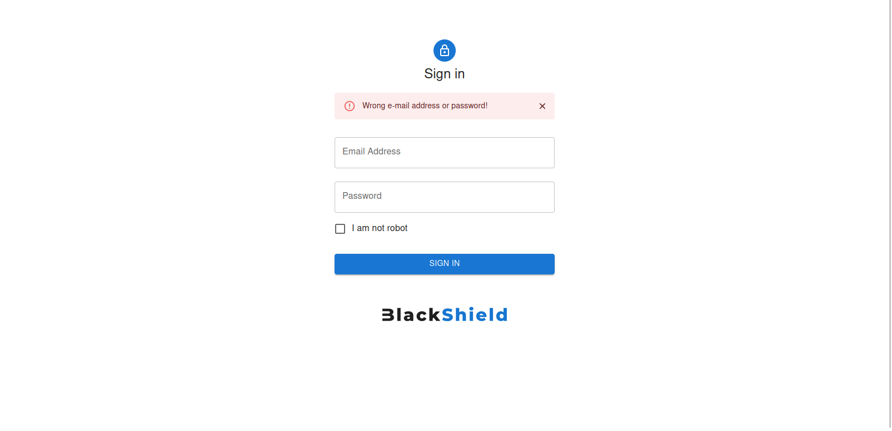
```
"/robots.txt"yi ziyaret ettiğimizde "/test"in arama motorları tarafından yakalanmaması için disallow edildiğini görüyoruz. Bu adresi ziyaret ettiğimizde aşağıdaki "testuser" kullanıcısının credential bilgisi ile karşılaşıyoruz.
```
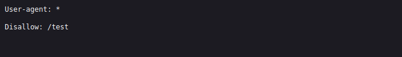
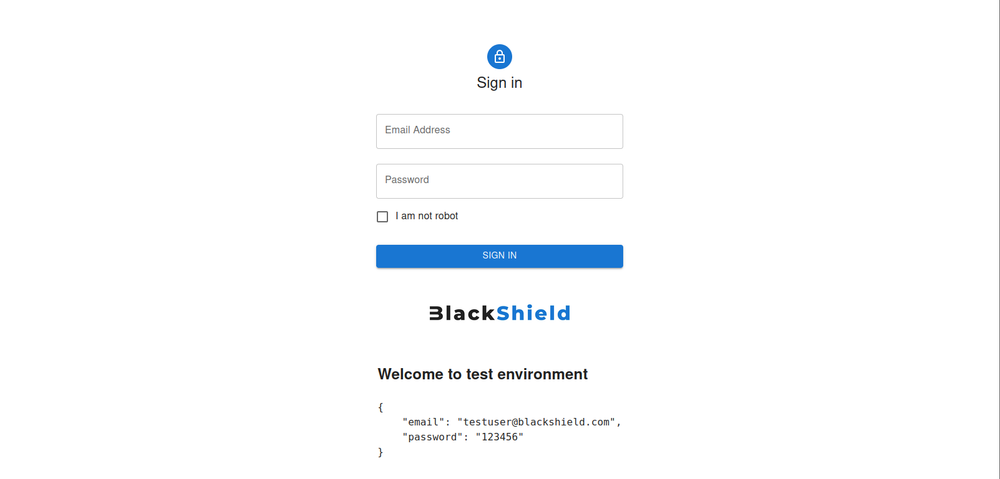
```
BurpSuite'ı açıp "testuser" kullanıcısına giriş yapıp sunucunun response'ı yakala dediğimizde sunucunun "user_token" isminde bir cookie set ettiğini tespit ediyoruz.
```
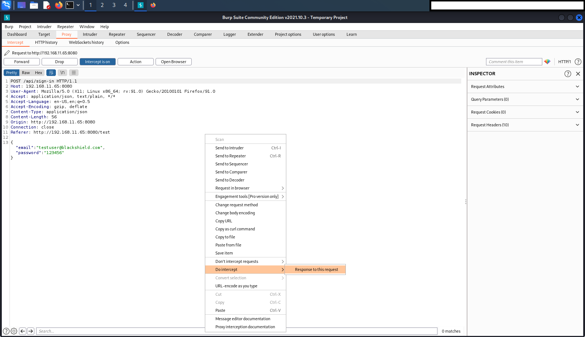
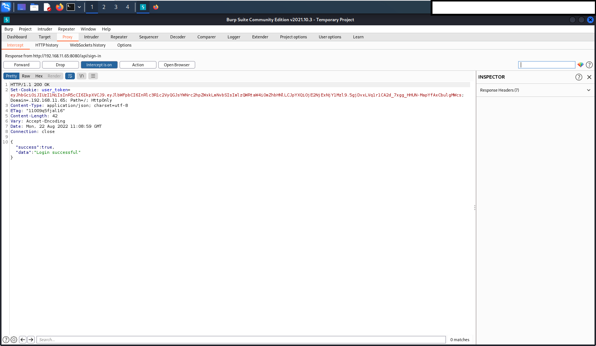
```
Set edilen cookie'nin değeri bir JWT. BurpSuite'deki "inspector" aracılığı ile JWT'yi decode ettiğimizde "isAdmin: false" şeklinde bir verinin olduğunu ve doğrulama algoritmasının "HS256" olduğunu görüyoruz.
```
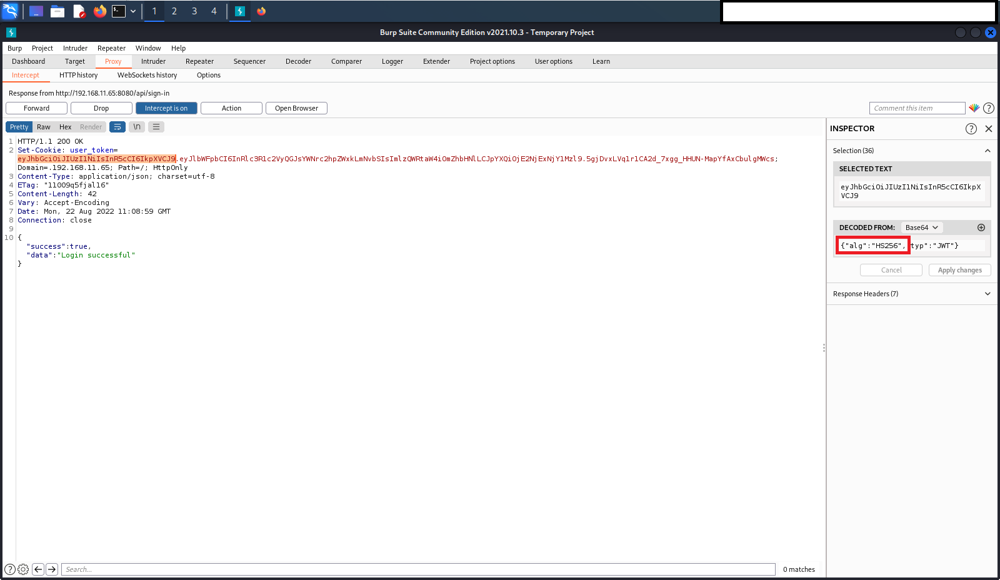
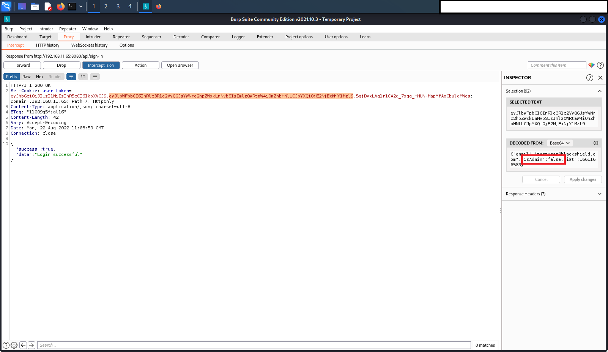
```
Sunucu "HS256" algoritması ile JWT'yi imzalıyor ve gönderilen isteklerdeki JWT'yi yine algoritma ile doğrulama işlemi yapmaya çalışıyor. Biz "isAdmin: true" olacak şekilde token'i patchlersek sunucudaki doğrulama işlemi başarısız olacaktır ve sunucu istediğimiz gibi bizi admin paneline yönlendirmeyecektir. Ancak bir token içerisindeki "alg" parametersini "none" yaparsak ve tokendeki imza kısmını silersek sunucu doğrulama yapmaya çalıştığında "alg" parametresinin "none" olmasından ötürü imza kontrolü yapamayacaktır. Böylece "isAdmin: true" şeklinde patchlediğimiz tokeni geçerli bir token olarak görüyor ve bizi admin paneline yönlendiriyor. Burada dikkat etmemiz gereken yer base64 encoding'teki "=" padding'i. JWT'nin geçerli olması için tokendeki "=" kısımlarını silmemiz gerekiyor.
```
```
1. "alg" parametresinin patchlenmesi 
```
   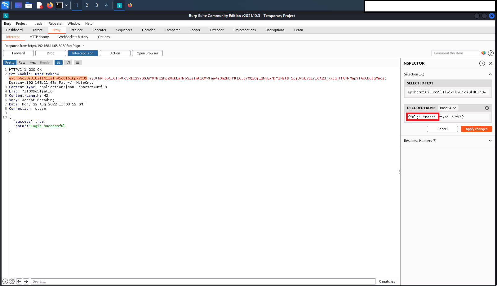
```
2. "isAdmin" değerinin patchlenmesi
```
   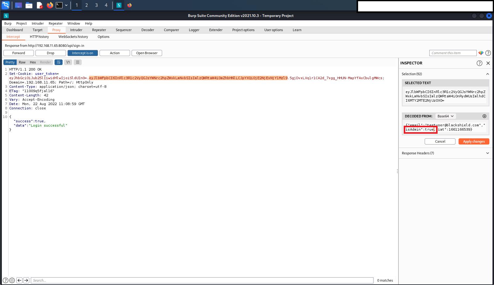
```
3. Base64 padding'lerinin silinmesi
```
   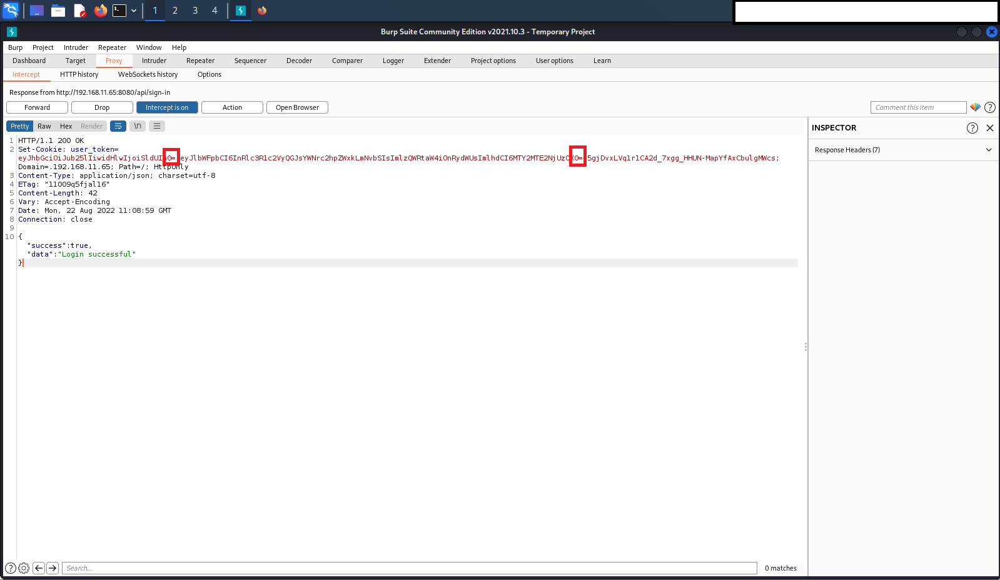
```
4. İmza kısmının silinmesi (sondaki "."nın kalması gerekiyor, aksi takdirde geçerli bir JWT formatı olmayacaktır)
```
   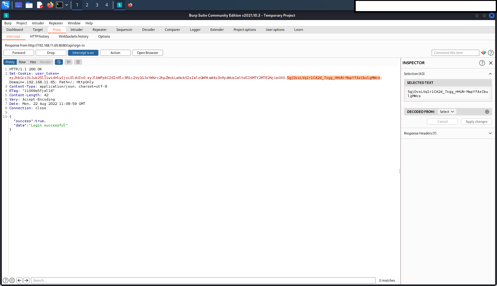
```
Yukarıdaki işlemlerden sonra elimize aşağıdaki gibi bir token geçiyor.
```
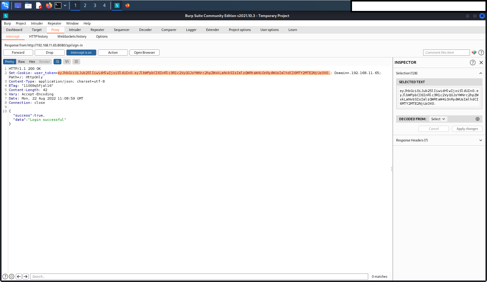
```
Admin paneline erişim sağladıktan sonra bir komut girme ekranı olduğunu görüyoruz. Buradan "ls -la" komutunu çalıştırdığımızda "FLAG.txt" bir dosya olduğunu tespit ediyoruz. "cat FLAG.txt" komutu ile flag'i elde ediyoruz.
```
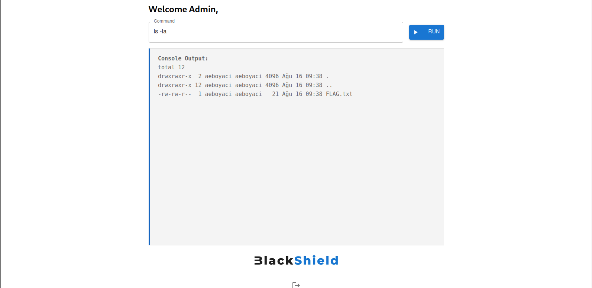
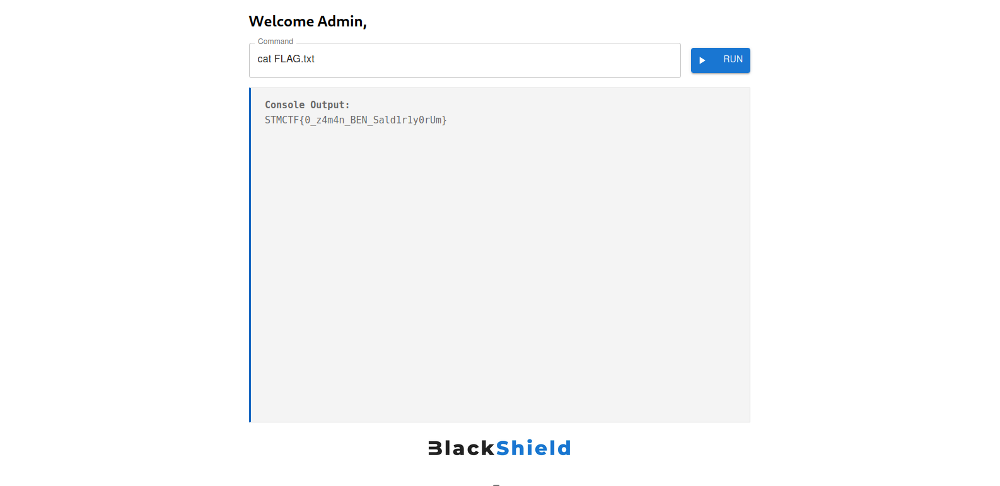
```
EN:

When we visit the given URL, a login panel would show up
```

```
We see that we are not able to login with default credentials such as "admin@blackshield.com:admin". Therefore, we check if we can find some credentials.
```

```
We find that "/test" route is disallowed in "/robots.txt". After visiting the route that we found, we can see "testuser"s credentials.
```


```
We try to login testuser while we are intercepting the HTTP requests with BurpSuite. When we intercept the response, we see a cookie named "user_token"
```


```
The cookie set from the server is a JWT. With the help of "inspector" in BurpSuite, we decode the token that we found in "user_token". We see that token has a data that contains a key named "isAdmin" with the value of "false", and has a header with the "alg": "HS256" parameter.
```


```
The server signs the JWT with the "HS256" algorithm and tries to verify the JWT in the sent requests with the same algorithm. If we patch the token data to be "isAdmin: true", the validation process on the server would fail and the server would not redirect us to the admin panel as we wanted. However, if we make the "alg" parameter in a token "none" and delete the signature part in the token, when the server tries to verify, it will not be able to check the signature because the "alg" parameter is "none". Thus, it sees the token that we patched as "isAdmin: true" as a valid token and directs us to the admin panel. Here we need to pay attention to the "=" padding in base64 encoding. For the JWT to be valid we need to delete the "=" portions of the token
```
```
1. Patching the "alg" parameter in token's header
```
   
```
2. Patching "isAdmin" in token data
```
   
```
3. Deleting the "=" padding
```
   
```
4. Delete the signature part (the trailing "." needs to remain, otherwise it will not be a valid JWT format)
```
   
```
After following the instructions given above, we get a token as follows:
```

```
After accessing the admin panel, we see that there is a command entry screen. When we run the "ls -la" command from here, we detect that there is a "FLAG.txt" file. We get the flag with the "cat FLAG.txt" command.
```


