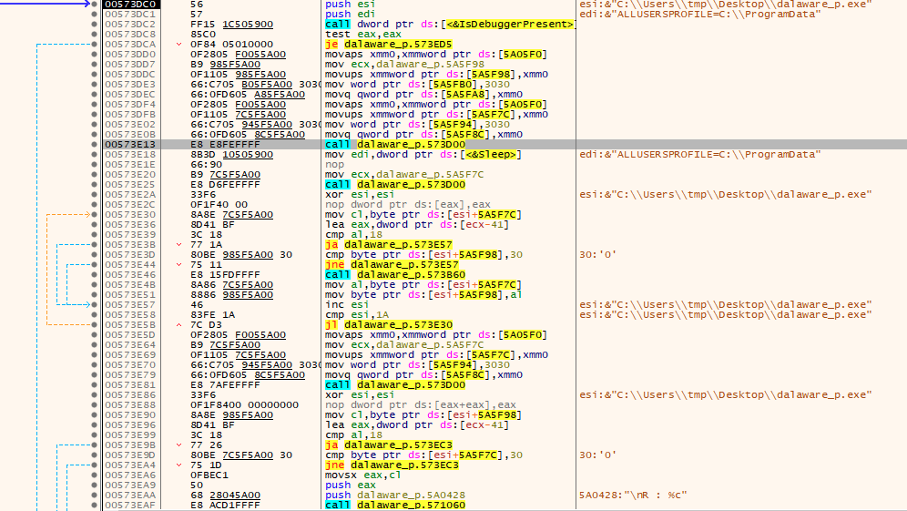
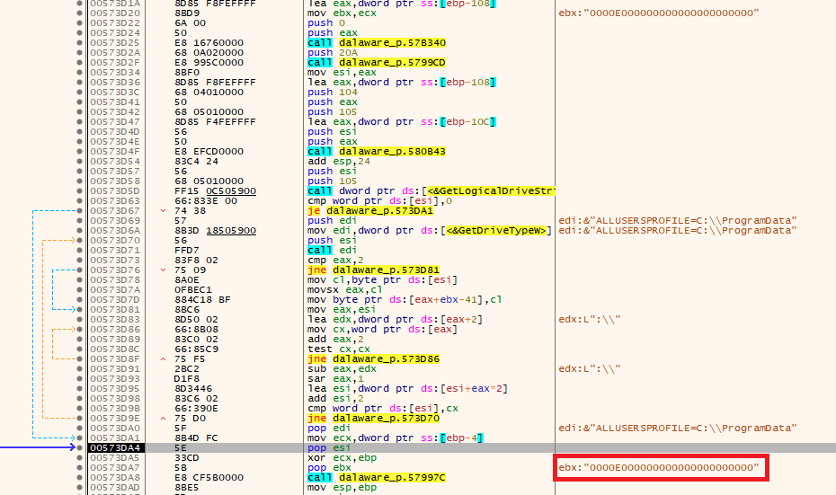
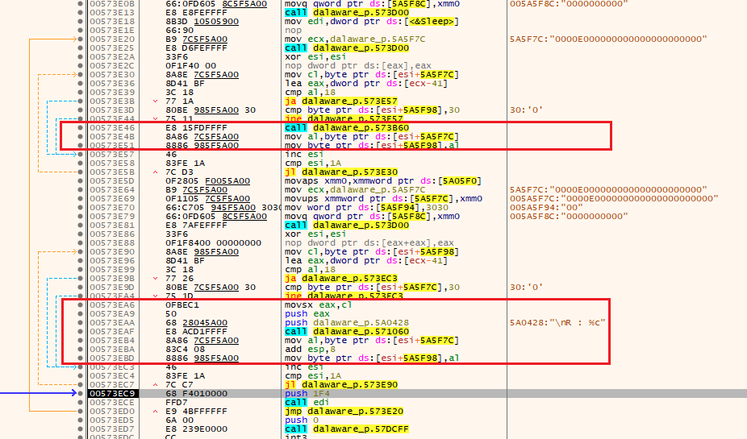
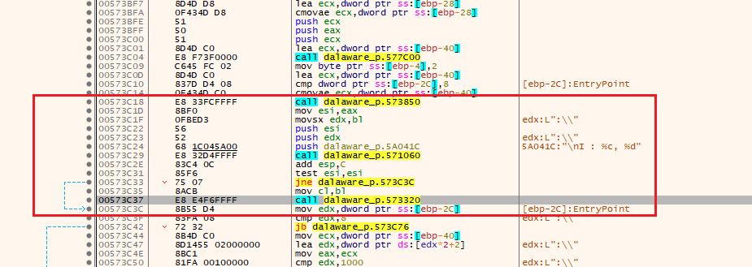
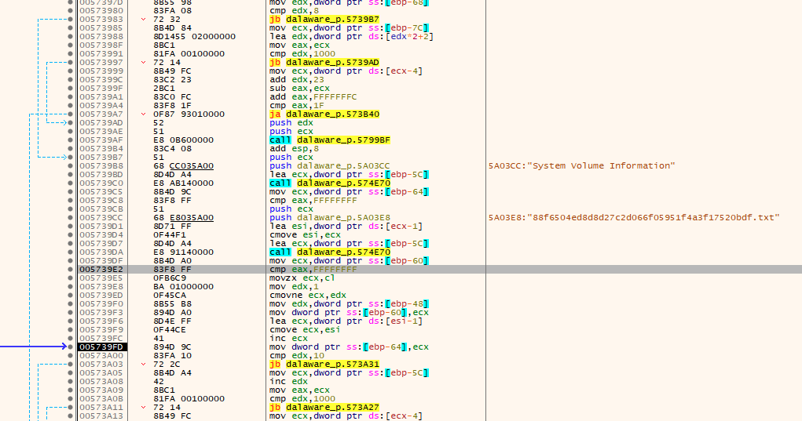
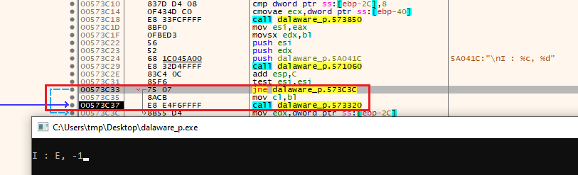
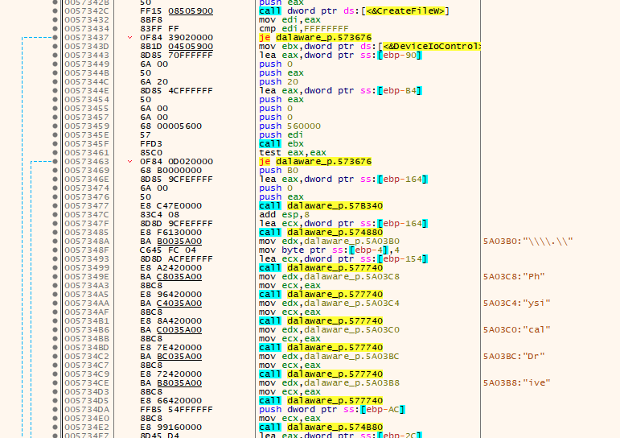
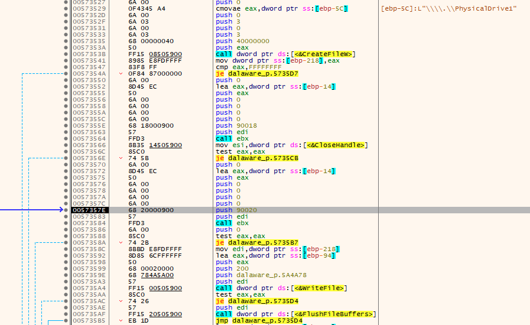
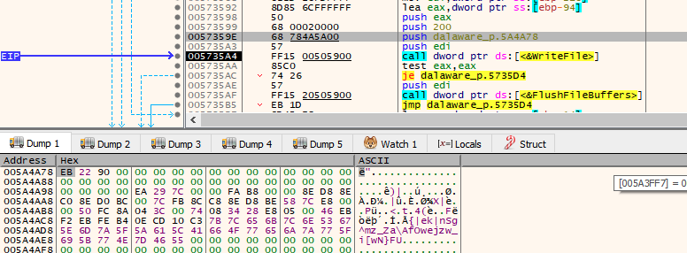
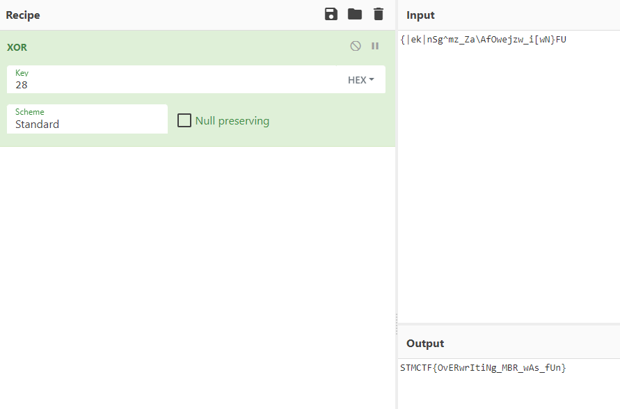

# STMCTF'22 Ön Eleme

## Soru İsmi:
`Dalaware`


## Kategori:
- `malware`


## Soru:

```
TR:
Sistemimize bir zararlı yazılım bulaştı. Ne yaptığını bulabilir misin?
--

EN:
Our system has infected with a malicious software. Can you find what it has done?
--
```

---

## Çözüm:

Bir debugger aracılığı ile dosya açılır ve incelenir.
TLS callback fonksiyonunda ve main'de bulunan IsDebuggerPresent kontrolü yamalandıktan analize devam edilir.



Main fonksiyonunda büyük bir döngü olduğu ve dalaware_p.573D00 fonksiyonunun 3 kere çağırıldığı görülür.



dalaware_p.573D00 fonksiyonu incelendiğinde GetLogicalDriveStringsW fonksiyonu ile bilgisayara bağlı mantıksal diklerin listelendiği, GetDriveType fonksiyonu ile disklerin çıkarılabilir disk olup olmadığı kontrol edildiği ve çıkarılabilir disklerin işaretlendiği 26 karakterlik bir string oluşturulduğu tespit edilir.

main fonksiyonu incelenmeye devam edilir ve ve 2 döngüye daha rastlanır. Döngülerin benzer olduğu fakat birinin bir fonksiyon çağırdığı diğerinin ise konsola bir yazı yazdığı görülür.



dalaware_p.573B60 fonksiyonu incelendiğinde dalaware_p.573850 fonksiyonu çalıştırılıp dönen değerin main fonksiyonuna benzer bir şekilde konsola yazıldığı görülür.



dalaware_p.573850 fonksiyonu incelendiğinde ise, E diskinin içindeki dosyalarının isimlerinin kontrol edilip "System Volume Information" ve "88f6504ed8d8d27c2d066f05951f4a3f17520bdf.txt" stringleri ile karşılaştırıldığı görülür. Fonksiyon sonunda bir sayı döndürdüğü görülür ve bu sayı diskteki dosya sayısı olduğu, kontrol edilen "System Volume Information" ve "88f6504ed8d8d27c2d066f05951f4a3f17520bdf.txt" dosyalarının bu sayıya etki etmediği tespit edilir.



Burada ekrana "I : %c, %d" stringi basıldıktan sonra 573C33 adresindeki jump komutu yamalanarak dalaware_p.573320 fonksiyonuna girilir.



dalaware_p.573320 fonksiyonu incelendiğinde CreateFileW fonksiyonu ile E diskinin açıldığı ve DeviceIoControl fonksiyonu ile E diskinin fiziksel disk numarasına erişildiği görülür.

internal const UInt32 IOCTL_VOLUME_GET_VOLUME_DISK_EXTENTS = 0x00560000;



dalaware_p.573320 fonksiyonunun devamında fiziksel diskin CreateFileW fonksiyonu ile açıldığı görülür.




Fiziksel diskin açıldıktan sonra DeviceIoControl fonksiyonlarında mantıksal diskin kitlendiği ve çıkartıldığı görülür.

public const int FSCTL_LOCK_VOLUME = 0x00090018;

public const int FSCTL_DISMOUNT_VOLUME = 0x00090020;

Daha sonra WriteFile fonksiyonunun aynı diske bir veri yazdığı görülür.

Bu adımdan sonra zararlı yazılımın takılan bir flash belleğe veri yazdığı görülünce sanal makineye içinde sadece 88f6504ed8d8d27c2d066f05951f4a3f17520bdf.txt dosyası oluşturulmuş bir flash bellek takılarak zararlı yazılımın çalışması sağlanır ve bilgisayar flash bellek üzerinden boot edilerek flag'e ulaşılır.


Diğer bir seçenek olarak analize devam edilir. WriteFile fonksiyonu parametrelerine bakıldığında diske 512 bytelık bir veri yazıldığı görülür ve veriye memory kısmından erişilerek "Binary -> Save to a File" özelliği ile bir dosyaya yazılır.



İlgili dosya IDA ile 16 bit modunda açılarak biraz düzenlemeler yapıldıktan sonra anlaşılabilir assembly koduna ulaşılır.


Kod incelendiğinde bir stringin xor ile değiştirildiği görülür.
String 0x28 değeri ile xorlanarak flag'e ulaşılır.



MBR kodunun orjinaline data.asm dosyasından ulaşılabilir.
