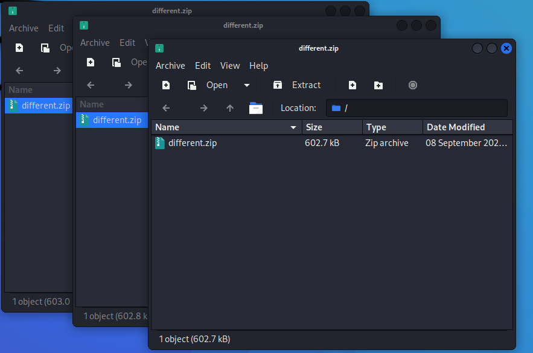
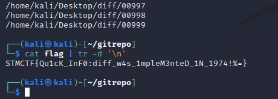

# STMCTF'22 Ön Eleme

## Soru İsmi:
`different`


## Kategori:
- `misc`

## Soru:

```
TR:
git repomun unified diff dosyalarını ekte gönderiyorum. Doğru bir sıra ile uygulayabilir misin?

EN:
I attached unified diff files of my git repo. Could you apply the patches in correct order?
```

---

## Çözüm:

Soruda verilen zip dosyasının iç içe zip dosyaları içerdiği görülür:



Dosyalar, aynı isimde olduğundan, içerisinden "different.zip" çıkmayıncaya kadar unzip ile açılır: 

    $ mv different.zip different_out.zip
    $ while true; do unzip different_out.zip; if [ ! -f different.zip ]; then break; else mv different.zip different_out.zip; fi; done

En sonunda `diff` klasörünün çıktığı görülür. İçerisinden adları base64 ile encode edilmiş diff dosyaları olduğu görülür. Öncelikle dosyaların isimleri decode edilir:

    $ cd diff/
    $ for i in $(ls); do fname=$(echo "$i" | base64 --decode); mv "$i" "$fname"; done

Dosya isimlerine bakıldığında patch dosyalarının sırası çıkmış olur. Patch'lerin uygulanması için boş bir git reposu açılıp bu patch'ler uygulanır:

    $ mkdir ~/gitrepo
    $ git init ~/gitrepo
    $ cd ~/gitrepo
    $ for i in $(find ~/Desktop/diff/ -type f | sort -n); do echo $i; git apply --unidiff-zero "$i"; done

Son komutta diff klasörünün masaüstünde olduğu varsayılmıştır. Diff dosyaları unified olduğundan ötürü git apply komutuna --unidiff-zero parametresi geçilmesi gerekmektedir.

Git haricinde direkt olarak patch kullanılarak da yapılabilir:

    $ mkdir ~/stmctf
    $ cd ~/stmctf
    $ for i in $(find ~/Desktop/diff -type f | sort -n); do echo $i; patch -p1 < "$i"; done

Patch'ler uygulandıktan sonra `flag` dosyasının oluştuğu görülür. İçerisinde flag bulunmaktadır.

    $ cat flag | tr -d '\n'


